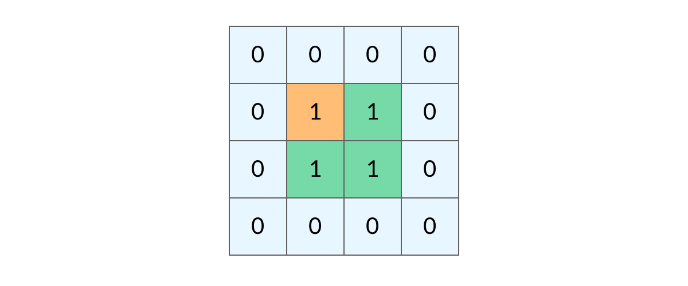
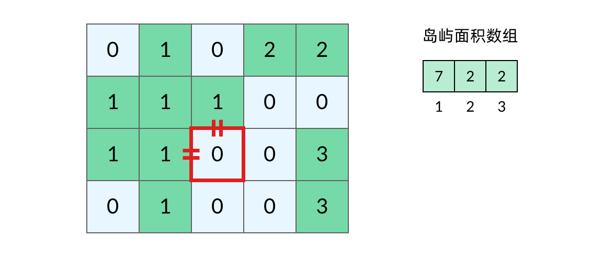
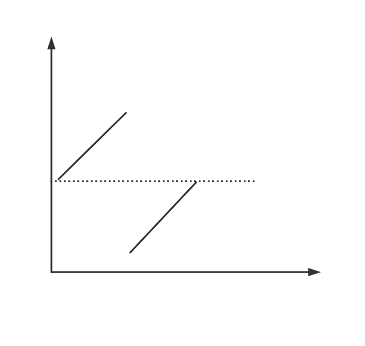
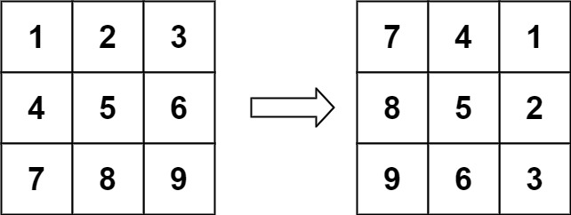
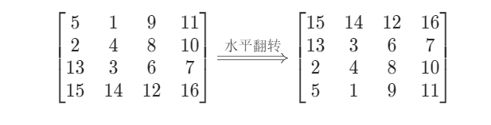
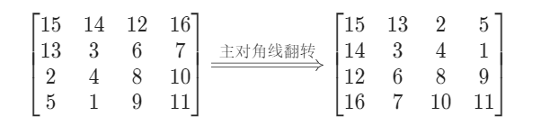
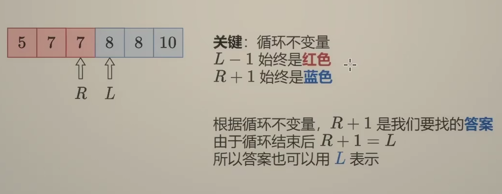

# markdown

Markdown-分数表示(Typora,Latex)
在写算法题解的时候，遇到在markdown中表示分数的情况，遂查询相关资料，以备后续查询使用。

表达式	显示效果
`$ {4ac \over b} $ `                                     	$ {4ac \over b} $

`$ {b-c} \over {2a} $ `                       $ {b-c} \over {2a} $

`$ \frac{a-b}{bc} $`                             $ \frac{a-b}{bc} $

`$ \frac ba $`	                    	$ \frac ba $

[更多语法](https://blog.csdn.net/qq_38342510/article/details/124064158)

# 异或交换两个数

```java
a=a^b;
//b=a^b^b=a^(b^b)=0^a=a
b=a^b;
//a=a^b^a=(a^a^b)=b
a=a^b;
```

# 提取最右的1


# 消去最右的1

X & (X - 1)

每次减一将最右的1及1右面的0翻转，然后与上自身后将最右的1和右面的所有数字都变为0

# 小和问题

```java
import org.junit.Test;

public class Leetcode {
    //小和问题
    @Test
    public void smallNum() {
        int[] array = {1,3,2,4,5};
        int l = 0, r = 4;
        System.out.println(process(array, l, r));
    }

    private int merge(int[] arr, int l, int mid, int r) {
        if (l == r) {
            return 0;
        }
        int p1 = l, p2 = mid + 1, i = 0;
        int result = 0;
        int[] temp = new int[r - l + 1];
        while (p1 <= mid && p2 <= r) {
            result += arr[p1] < arr[p2] ? (r - p2 + 1) * arr[p1] : 0;
            temp[i++] = arr[p1] < arr[p2] ? arr[p1++] : arr[p2++];
        }
        while (p1 <= mid) {
            temp[i++] = arr[p1++];
        }

        while (p2 <= r) {
            temp[i++] = arr[p2++];
        }
        System.arraycopy(temp, 0, arr, l, temp.length);
        return result;
    }
/*
* 递归求小和=左侧小和+右侧小和+合并以后产生的新的小和
* */
    private int process(int[] arr, int l, int r) {
        int mid = l + ((r - l) >> 1);
        if (l == r) {
            return 0;
        }

        return process(arr, l, mid) +
                process(arr, mid + 1, r) +
                merge(arr, l, mid, r);//只有在左侧小于右侧时才会产生右侧个数*左侧数值的小和
    }
}
```

# 逆序对

同上 

# 快排

**思路：总体是递归**

**对数组从left 到 right 进行排序， 先在范围内选择一个哨兵，然后将数组递归的在left到哨兵之前和哨兵之后到right排序，直到left等于right排序就完成了，具体的某一趟排序：将哨兵挪到最后，然后维护两个指针i,j使得i左面的元素都小于哨兵j右面的元素都大于等于哨兵，当i>j时，交换i和哨兵的位置就在这趟排序中完成**

 

```java
class Solution {
    public int[] sortArray(int[] nums) {
        randomizedQuicksort(nums, 0, nums.length - 1);
        return nums;
    }

    public void randomizedQuicksort(int[] nums, int l, int r) {
        if (l < r) {
            int i = new Random().nextInt(r + 1 - l) + l;
            swap(nums, i, r);
            int sentry = nums[r];
            int left = l, j = r - 1;
            while (j >= left && nums[j] >= sentry) {
                j--;
            }
            while (left <= j) {
                if (nums[left] >= sentry) {
                    swap(nums, left, j);
                    j--;
                } else {
                    left++;
                }
            }
            swap(nums, left, r);
            randomizedQuicksort(nums, l, left - 1);
            randomizedQuicksort(nums, left + 1, r);
        }
    }

    private void swap(int[] nums, int i, int j) {
        int temp = nums[i];
        nums[i] = nums[j];
        nums[j] = temp;
    }
}
```

# 堆排

**思路：用数组构建一个大顶堆，然后每次将堆顶的最大元素与末尾元素交换，再维护去除最后一位元素的堆，循环下去直到堆中只有一个元素**

```java
 public void heapSort(int[] nums) {
        int r = nums.length - 1;
        buildMaxHeap(nums, r);
        for (int i = r; i > 0; i--) {
            swap(nums, 0, i);
            maxHeapify(nums, 0, i - 1);
        }
    }

    public void buildMaxHeap(int[] nums, int len) {
        for (int i = len >> 1; i >= 0; i--) {
            maxHeapify(nums, i, len);
        }
    }

    public void maxHeapify(int[] nums, int i, int len) {
        while (i <= len >> 1) {
            if (i * 2 + 1 > len) {
                return;
            }
            int lson = i * 2 + 1;
            int rson = i * 2 + 2;
            int max = i;
            if (nums[i] < nums[lson]) {
                max = lson;
            }
            if (rson <= len) {
                if (nums[rson] > nums[max]) {
                    max = rson;
                }
            }
            if (max != i) {
                swap(nums, max, i);
                i = max;
            } else {
                break;
            }
        }
        
    private void swap(int[] nums, int i, int j) {
        int temp = nums[i];
        nums[i] = nums[j];
        nums[j] = temp;
    }

    }
```

## 优先级队列

java提供的以小顶堆为结构的

```java
PriorityQueue<Integer> heap = new PriorityQueue<>();
```


可以解决基本有序数组排序问题（即每个数在最终排好序的位置与当前位置的差不超过K）


# 归并排序

**很简单的递归思想，将数组从中间分开，分别对左右两个数组进行排序，得到两个有序数组进行合并即可**

```java
 public int[] sortArray(int[] nums) {
        tmp = new int[nums.length];
        mergeSort(nums, 0, nums.length - 1);
        return nums;
    }

    public void mergeSort(int[] nums, int l, int r) {
        if (l >= r) {
            return;
        }
        int mid = l + (r - l >> 1);
        mergeSort(nums, l, mid);
        mergeSort(nums, mid + 1, r);
        int cnt = 0;
        int i = l, j = mid + 1;
        while (i <= mid && j <= r) {
            if (nums[i] >= nums[j]) {
                tmp[cnt++] = nums[j];
                j++;
            } else {
                tmp[cnt++] = nums[i];
                i++;
            }
        }
        while (i <= mid) {
            tmp[cnt++] = nums[i++];
        }
        while (j <= r) {
            tmp[cnt++] = nums[j++];
        }
        System.arraycopy(tmp, 0, nums, l, cnt);
    }
```


# 桶排

```java
package com.dlut.ln;

import org.junit.Test;
import org.springframework.boot.test.context.SpringBootTest;

import java.util.Arrays;

@SpringBootTest
public class BucketTest {
    public void bucketSort(int[] arr, int maxSize) {

        for (int i = 0; i < maxSize; i++) {
            process(arr, i);
        }
    }

    public void process(int[] arr,int n) {
        int sum = 0;
        int[] temp = new int[10];
        int[] temp2 = new int[arr.length];
        for (int j : arr) {
            temp[(int) (j /Math.pow(10, n) % 10)]++;
        }
        for (int i = 0; i < temp.length; i++) {
            sum += temp[i];
            temp[i] = sum;
        }
//        System.out.println(Arrays.toString(temp));
        for (int i = arr.length - 1; i >= 0; i--) {
            //当temp数值为零时 不对 temp不会遍历到零的位置 根本没有这个数
            temp2[--temp[(int) (arr[i] /Math.pow(10, n) % 10)]] = arr[i];//取个位数对应的临时数组的值 即按个位排序有多少个数小于等于当前数 放在减一的位置上 并将temp数组的值减一
        }
//        System.out.println(Arrays.toString(temp2));
        System.arraycopy(temp2, 0,arr,0,temp2.length);
    }

@Test
    public void test() {
    int[] arr = {5, 1, 9,11, 4, 3, 99, 166, 88, 25, 7, 48};
    bucketSort(arr, 3);
    System.out.println(Arrays.toString(arr));
    }
}
```

# 总结

| 方法 | 时间  | 空间 | 稳定 |
| :--: | ----- | ---- | ---- |
| 归并 | nlogn | n    | √    |
| 快排 | nlogn | logn | ×    |
| 堆排 | nlogn | 1    | ×    |

实验来看快排最快 但是有空间且不稳定 堆排不用空间 但是不稳定 归并有空间但是稳定


## 回文链表


```java
class Node {
        int val;
        Node next;
        Node random;

        public Node(int val) {
            this.val = val;
            this.next = null;
            this.random = null;
        }
    }

    //暴力解法
        public boolean copyRandomList(Node head) {
            if (head.next == null || head.next.next == null) {
                return true;
            }
            Node slow = head;
            Node fast = head;
            Node p = head.next;
            Stack<Node> nodeStack = new Stack<>();
            while (fast != null && fast.next != null) {
                slow = slow.next;
                fast = fast.next.next;
            }
            slow = slow.next;
            while (slow != null) {
                nodeStack.push(slow);
                slow = slow.next;
            }
            while (!nodeStack.isEmpty()) {
                Node popNode = nodeStack.pop();
//                System.out.println("st: " + popNode.val);
//                System.out.println("p:  " + p.val);
                if (p.val != popNode.val) {
                    return false;
                } else {
                    p = p.next;
                }
            }
            return true;
        }


//不用栈 空间为O(1)
    public boolean copyRandomList2(Node head) {
        //空链表或者一个节点默认为回文
        if (head.next == null || head.next.next == null) {
            return true;
        }
        Node slow = head;
        Node fast = head;
        Node p = head.next;
        //结束循环后slow指向奇数个数中间位置或者偶数个数前面的位置
        while (fast != null && fast.next != null) {
            slow = slow.next;
            fast = fast.next.next;
        }
//        //三个指针实现后半段链表的逆序  就像这样1->3<-2  其中3指向null
        Node p1 = slow;
        Node p2 = p1.next;
//        后半段存在两个以上节点时才创建创建p3 否则后半段只有一个节点也就是说总共只有三个节点 这时只需比较第一个和第三个的值是否相等
        if (p2.next != null) {
            Node p3 = p2.next;
            p1.next = null;//中间节点指向null
//            三个指针实现后半段逆序 结束循环后P1 P2 P3分别指向最末尾的三个节点
            while (p3.next != null) {
                p2.next = p1;
                p1 = p2;
                p2 = p3;
                p3 = p3.next;
            }


            p2.next = p1;
            p3.next = p2;
            //将被逆转了的链表复原所用
            p1 = p3;

            while (p3.next != null) {
                //从两边向中间遍历 想等即为回文 否则返回FALSE
                if (p.val != p3.val) {
                    //返回FALSE之前 将后半段变为正序 采用三个指针slow和p1 p2 头插法实现
                    while (p2 != slow) {
                        p1.next = slow.next;
                        slow.next = p1;
                        p1 = p2;
//                System.out.println(p2.val);
                        p2 = p2.next;
                    }
                    p1.next = slow.next;
                    slow.next = p1;
                   /* while (head != null) {
                        System.out.println(head.val);
                        head = head.next;
                    }*/
                    return false;
                }
                p3 = p3.next;
                p = p.next;
            }
//            同理 返回TRUE之前也要处理后半段链表
            while (p2 != slow) {
                p1.next = slow.next;
                slow.next = p1;
                p1 = p2;
//                System.out.println(p2.val);
                p2 = p2.next;
            }
            p1.next = slow.next;
            slow.next = p1;
           /* while (head != null) {
                System.out.println(head.val);
                head = head.next;
            }*/
            return true;
        } else/*上文所说总共只有三个节点的情况*/ {
//            这里没有对后半段链表进行处理  所以不用在变为正序
         /*   while (head != null) {
                System.out.println(head.val);
                head = head.next;
            }*/
            return p.val == p2.val;
        }
    }
```

## 有环无环

用hashset判断

不用额外空间时采用快慢指针   若有环则相遇 快指针回到原点再次相遇即为环首


## 非递归遍历

先序：将头结点放入栈中，然后pop 每次pop都将该节点的右孩子 左孩子 依次入栈 重复

中序：先push左孩子 为空时开始pop 每次pop都检查右孩子 不为空就push 

后序：将头结点放入栈中 然后pop 将pop的点push进另一个栈 每次pop都将该节点的左孩子 右孩子 依次入栈 重复 然后pop另一个栈

## 题目

折纸求纸痕的排列顺序

其实除了第一次对折会产生一个凹痕 剩下的每次对折都是在当前已经有的折痕上方产生一个凹痕 下方产生一个凸痕 也就是说折叠N次的纸条的痕迹就是N层的 头结点为凹的 每一个节点的左孩子为凹右孩子为凸的满二叉树  而折痕从上向下的顺序也就是对应的二叉树的中序遍历

# 从高位到低位解析数字

给定不定长数字字符串 如“321” 如何从左往右依次解析

```java
int num = 0;
int i = 0;
String s = "321560";
while(i < num.length){
    num = num * 10 + Integer.ParseInt(s.charAt(i));
    i++;
}
```

## 经典解析字符串

给定一个经过编码的字符串，返回它解码后的字符串。

编码规则为: k[encoded_string]，表示其中方括号内部的 encoded_string 正好重复 k 次。注意 k 保证为正整数。

你可以认为输入字符串总是有效的；输入字符串中没有额外的空格，且输入的方括号总是符合格式要求的。

此外，你可以认为原始数据不包含数字，所有的数字只表示重复的次数 k ，例如不会出现像 3a 或 2[4] 的输入。

 

示例 1：

输入：s = "3[a]2[bc]"
输出："aaabcbc"
示例 2：

输入：s = "3[a2[c]]"
输出："accaccacc"
示例 3：

输入：s = "2[abc]3[cd]ef"
输出："abcabccdcdcdef"
示例 4：

输入：s = "abc3[cd]xyz"
输出："abccdcdcdxyz"

```java
class Solution {
    public String decodeString(String s) {
  Queue<Character> q = new LinkedList<>();
        int i = 0;
        while (i < s.length()) {
            q.add(s.charAt(i));
            i++;
        }
        return process(q);
    }
     String process( Queue<Character> q ) {
        StringBuilder res=new StringBuilder();
        int num = 0;
        while (!q.isEmpty()) {
            Character s = q.poll();
            if (s >= 'a' && s <= 'z') {
                 res.append(s);
            }
            if (s >= '0' && s <= '9') {
                num = 10 * num + Integer.parseInt(s.toString());
            }
            if (s == '[' ) {
                String temp = process(q);
                while (num > 0) {
                res.append(temp);
                num--;
                }
            }
            if (s == ']') {
                return res.toString();
            }
        }
        return res.toString();
    }
}
```

# 哈希

## 布隆过滤器

1、什么是布隆过滤器
布隆过滤器（Bloom Filter）是1970年由布隆提出的。它实际上是一个很长的二进制向量和一系列随机映射函数。布隆过滤器可以用于检索一个元素是否在一个集合中。它的优点是空间效率和查询时间都比一般的算法要好的多，缺点是有一定的误识别率和删除困难。


上面这句介绍比较全面的描述了什么是布隆过滤器，如果还是不太好理解的话，就可以把布隆过滤器理解为一个set集合，我们可以通过add往里面添加元素，通过contains来判断是否包含某个元素。由于本文讲述布隆过滤器时会结合Redis来讲解，因此类比为Redis中的Set数据结构会比较好理解，而且Redis中的布隆过滤器使用的指令与Set集合非常类似（后续会讲到）。


学习布隆过滤器之前有必要先聊下它的优缺点，因为好的东西我们才想要嘛！
布隆过滤器的优点：

时间复杂度低，增加和查询元素的时间复杂为O(N)，（N为哈希函数的个数，通常情况比较小）
保密性强，布隆过滤器不存储元素本身
存储空间小，如果允许存在一定的误判，布隆过滤器是非常节省空间的（相比其他数据结构如Set集合）
布隆过滤器的缺点：

有点一定的误判率，但是可以通过调整参数来降低
无法获取元素本身
很难删除元素
2、布隆过滤器的使用场景
布隆过滤器可以告诉我们 “某样东西一定不存在或者可能存在”，也就是说布隆过滤器说这个数不存在则一定不存，布隆过滤器说这个数存在可能不存在（误判，后续会讲），**利用这个判断是否存在的特点可以做很多有趣的事情。

解决Redis缓存穿透问题（面试重点）
邮件过滤，使用布隆过滤器来做邮件黑名单过滤
对爬虫网址进行过滤，爬过的不再爬
解决新闻推荐过的不再推荐(类似抖音刷过的往下滑动不再刷到)
HBase\RocksDB\LevelDB等数据库内置布隆过滤器，用于判断数据是否存在，可以减少数据库的IO请求
3、布隆过滤器的原理
3.1 数据结构
布隆过滤器它实际上是一个很长的二进制向量和一系列随机映射函数。以Redis中的布隆过滤器实现为例，Redis中的布隆过滤器底层是一个大型位数组（二进制数组）+多个无偏hash函数。
一个大型位数组（二进制数组）：


多个无偏hash函数：
无偏hash函数就是能把元素的hash值计算的比较均匀的hash函数，能使得计算后的元素下标比较均匀的映射到位数组中。

如下就是一个简单的布隆过滤器示意图，其中k1、k2代表增加的元素，a、b、c即为无偏hash函数，最下层则为二进制数组。


3.2 空间计算
在布隆过滤器增加元素之前，首先需要初始化布隆过滤器的空间，也就是上面说的二进制数组，除此之外还需要计算无偏hash函数的个数。布隆过滤器提供了两个参数，分别是预计加入元素的大小n，运行的错误率f。布隆过滤器中有算法根据这两个参数会计算出二进制数组的大小l，以及无偏hash函数的个数k。
它们之间的关系比较简单：

错误率越低，位数组越长，控件占用较大


## 公式

不安全网页的黑名单包含100亿个黑名单网页，每个网页的URL最多占用64字节。现在想要实现一种网页过滤系统，可以根据网页的URL判断该网站是否在黑名单上，请设计该系统。要求该系统允许有万分之一以下的判断失误率，并且使用的额外空间不要超过30G。

解题：布隆过滤器的bitarray大小如何确定？

设bitarray大小为m，样本数量为n，失误率为p。
由题可知 n = 100亿，p = 0.01%
单个样本大小不影响布隆过滤器大小，因为样本会通过哈希函数得到输出值。
使用样本数量n和失误率p可以算出m，公式为：


求得 m = 19.19n，向上取整为 20n。所以2000亿bit，约为25G。
所使用哈希函数个数k可以由以下公式求得：


所以 k = 14，即需要14个哈希函数。
通过 m = 20n， k = 14，可以通过以下公式算出设计的布隆过滤器的真实失误率为0.006%。


## 一致性哈希

一致性hash算法是因为节点数目发生改变时，尽可能少的数据迁移而出现的。比如扩容时，需要50%的数据迁移；但如果引入一种算法，可以减少数据的迁移量，所以就出现了一致性hash算法。将所有的存储节点排列在收尾相接的hash环上，每个key在计算Hash后会顺时针找到临接的存储节点存放。而当有节点加入或退出时，仅影响该节点在Hash环上顺时针相邻的后续节点。

1. 优点
	加入和删除节点只影响哈希环中顺时针方向的相邻的节点，对其他节点无影响。
2. 缺点
	数据的分布和节点的位置有关，因为这些节点不是均匀的分布在哈希环上的，所以数据在进行存储时达不到均匀分布的效果。所以，出现了增加虚拟节点的方式来减少不均衡的现象。

## 算法演示

1、首先，我们将hash算法的值域映射成一个具有2的32次方个桶的空间中，即0~（2的32次方）-1的数字空间。现在我们可以将这些数字头尾相连，组合成一个闭合的环形。
2、每一个缓存key都可以通过Hash算法转化为一个32位的二进制数，也就对应着环形空间的某一个缓存区。我们把所有的缓存key映射到环形空间的不同位置。
3、我们的每一个缓存节点也遵循同样的Hash算法，比如利用IP或者主机名做Hash，映射到环形空间当中，如下图


### 如何让key和缓存节点对应起来呢？

很简单，每一个key的顺时针方向最近节点，就是key所归属的缓存节点。所以图中key1存储于node1，key2，key3存储于node3，key4存储于node4。


当缓存的节点有增加或删除的时候，一致性哈希的优势就显现出来了。让我们来看看实现的细节：

#### 增加节点

当缓存集群的节点有所增加的时候，整个环形空间的映射仍然会保持一致性哈希的顺时针规则，所以有一小部分key的归属会受到影响。


#### 有哪些key会受到影响呢？

图中加入了新节点node4，处于node1和node2之间，按照顺时针规则，从node1到node4之间的缓存不再归属于node2，而是归属于新节点node4。因此受影响的key只有key2。


最终把key2的缓存数据从node2迁移到node4，就形成了新的符合一致性哈希规则的缓存结构。

#### 删除节点

当缓存集群的节点需要删除的时候（比如节点挂掉），整个环形空间的映射同样会保持一致性哈希的顺时针规则，同样有一小部分key的归属会受到影响。


#### 有哪些key会受到影响呢？

图中删除了原节点node3，按照顺时针规则，原本node3所拥有的缓存数据就需要“托付”给node3的顺时针后继节点node1。因此受影响的key只有key4。


最终把key4的缓存数据从node3迁移到node1，就形成了新的符合一致性哈希规则的缓存结构。

说明：这里所说的迁移并不是直接的数据迁移，而是在查找时去找顺时针的后继节点，因缓存未命中而刷新缓存。
计算方法：假设节点hash散列均匀（由于hash是散列表，所以并不是很理想），采用一致性hash算法，缓存节点从3个增加到4个时，会有0-33%的缓存失效，此外新增节点不会环节所有原有节点的压力。

如果出现分布不均匀的情况怎么办？
一致性hash算法的结果相比传统hash求余算法已经进步很多，但是出现分布不均匀的情况会有问题。比如下图这样，按顺时针规则，所有的key都归属于统一个节点。


### 雪崩效应

接下来我们来看一下，当有节点宕机时会有什么问题。如下图：


如上图，当B节点宕机后，原本存储在B节点的k1，k2将会迁移到节点C上，这可能会导致很大的问题。如果B上存储的是热点数据，将数据迁移到C节点上，然后C需要承受B+C的数据，也承受不住，也挂了。然后继续CD都挂了。这就造成了雪崩效应。

### 一致性hash升级版

为了解决节点太少而产生的数据分配不均衡的问题，也可能导致雪崩效应。一致性hash通过引入虚拟节点的方式做了优化。

所谓虚拟节点，就是基于原来的物理节点映射出N个子节点，最后把所有的子节点映射到环形空间上。


虚拟节点越多，分布越均匀。使用一致性hash算法+虚拟节点这种情况下，缓存节点从3个变成4个，缓存失效率为25%，而且每个节点都平均的承担了压力。

# 并查集

顾名思义，并查集是来解决图的连通性问题

Union -- 连接两个节点

Find -- 查找所属的连通分量

所以，并查集主要就是实现以下接口：


class UF {
    /* 将 p 和 q 连接 */
    public void union(int p, int q);
    /* 判断 p 和 q 是否连通 */
    public boolean connected(int p, int q);
    /* 返回图中有多少个连通分量 */
    public int count();
    

    /* 返回当前节点的根节点 */
    private int find(int x);

}
存储数据结构
如何表示节点与节点之间的连通性关系呢？？

如果 p 和 q 连通，则它们有相同的根节点
用数组 parent[] 来表示这种关系

如果自己就是根节点，那么 parent[i] = i，即自己指向自己

如果自己不是根节点，则 parent[i] = root id


private int count;
private int[] parent;
// 构造函数
public UF (int n) {
    this.count = n;
    parent = new int[n];
    for (int i = 0; i < n; i++) {
        // 最初，每个节点均是独立的
        parent[i] = i;
    }
}
Union 方法
介绍了存储的数据结构，那如何把两个节点连接起来呢？？

很简单，只需将其中任一一个节点的根节点指向另一个节点的根节点即可


// 伪代码
public void union(int p, int q) {
    // 找到 p 的根节点 rootP
    // 找到 q 的根节点 rootQ
    // 如果已经在同一个连通分中，跳过
    // parent[rootP] = rootQ
    // 或 parent[rootQ] = rootP
}
现在的问题就变成了如何快速找到某一个节点的根节点！！

刚刚介绍数据结构的时候，强调了根节点的特点，即自己指向自己


private int find(int x) {
    while (x != parent[x]) {
        x = parent[x];
    }
    return x;
}
如何，是不是很简单，哈哈哈哈哈哈

connected() && count()
这两个方法的实现很简单


public boolean connected(int p, int q) {
    int rootP = find(p);
    int rootQ = find(q);
    return rootP == rootQ;
}
count()需要维护一个全局变量，来记录图的连通分量的数量

另外，我们需要明确的是：只有在调用 union() 方法时，才可能改变连通分量的数量


public void union(int p, int q) {
    int rootP = find(p);
    int rootQ = find(q);
    if (rootP == rootQ) return;
    parent[rootP] = rootQ;
    // 连通分量 -1
    count--;
}
public int count() {
    return this.count;
}
瓶颈分析
行文至此，已经把并查集的所有接口实现。但这远远不够，因为此时的代码还不完美，时间复杂度可能会很高

分析上述实现的方法，find() 是决定并查集时间复杂度的重要因素。抛开 find() 因素，其他方法的时间复杂度均可视为 O(1)。所以如果要优化算法的时间复杂度，需要用 find() 入手

对于有 n 个节点 1 个连通分量的并查集来说，最坏的时间复杂度为 O(n)，最好的时间复杂度为 O(1)

最坏情况：全部只有左孩子

最好情况：n - 1 叉树，即根节点有 n - 1 个孩子

优化角度 1：平衡性优化
思路：当我们每次连接两个节点的时候，不希望出现头重脚轻的情况，而希望到达一种平衡的状态

使用额外的一个数组 size[] 记录每个连通分量中的节点数，每次均把节点数少的分量接到节点数多的分量上，如图


注意：只有每个连通分量的根节点的 size[] 才可以代表该连通分量中的节点数


private int count;
private int[] parent;
private int[] size;
// 构造函数
public UF (int n) {
    this.count = n;
    parent = new int[n];
    size = new int[n];
    for (int i = 0; i < n; i++) {
        parent[i] = i;
        // 最初，每个连通分量均为 1
        size[i] = 1;
    }
}
public void union(int p, int q) {
    int rootP = find(p);
    int rootQ = find(q);
    if (rootP == rootQ) return;
    /******** 修改部分 ********/
    if (size[rootP] < size[rootQ]) {
        parent[rootP] = rootQ;
        size[rootQ] += size[rootP]
    } else {
        parent[rootQ] = rootP;
        size[rootP] += size[rootQ]
    }
    /********** end **********/
    count--;
}
优化角度 2：路径压缩
思路：使树高始终保持为常数


private int find(int x) {
    while (parent[x] != x) {
        // 进行路径压缩
        parent[x] = parent[parent[x]];
        x = parent[x];
    }
    return x;
}
注意：

路径压缩优化比平衡性优化更为常用
当使用了路径压缩优化后，平衡性优化可以不使用
但是可以在某些题目中采用平衡性优化的思想，如 128. 最长连续序列
完整模版

class UF {
    private int count;
    private int[] parent;
    private int[] size;
    public UF(int n) {
        this.count = n;
        parent = new int[n];
        size = new int[n];
        for (int i = 0; i < n; i++) {
            parent[i] = i;
            size[i] = 1;
        }
    }
    public void union(int p, int q) {
        int rootP = find(p);
        int rootQ = find(q);
        if (rootP == rootQ) return ;
        // 平衡性优化
        if (size[rootP] < size[rootQ]) {
            parent[rootP] = rootQ;
            size[rootQ] += size[rootP];
        } else {
            parent[rootQ] = rootP;
            size[rootP] += size[rootQ];
        }
        this.count--;
    }
    public boolean conneted(int p, int q) {
        int rootP = find(p);
        int rootQ = find(q);
        return rootP == rootQ;
    }
    public int count() {
        return this.count;
    }
    private int find(int x) {
        while (x != parent[x]) {
            // 路径压缩
            parent[x] = parent[parent[x]];
            x = parent[x];
        }
        return x;
    }
}


# kmp

关于KMP核心思想即最大相等前缀与后缀。

当目标字符串与匹配字符串出现不相等时，不再跳回字符串开头，而是跳回匹配字符串的当前元素的最大相等缀的下一位。


而目标字符串的前缀数组生成策略是：


0位为-1

1位为0

第i位的值根据i - 1位的值来确定 

如果匹配字符串第next[i - 1]的值与第i - 1相等 那么next[i]就等于next[i-1]+1

如果不等并且next[i - 1]大于等于零 就将匹配字符串第I -1位与next[next[i -1 ]]相比较

直到next【i-1】小于零或者相等为止

```java
public int kmp(String haystack, String needle) {
    if(haystack.length() < needle.length()){
        return -1;
    }
    if (needle.length() == 0) {
        return 0;
    }
    char[] chars = needle.toCharArray();
    int[] next = getNext(chars);
    int i = 0, j = 0;
    while (i < haystack.length() && j < needle.length()) {
        if (haystack.charAt(i) == needle.charAt(j)) {
            i++;
            j++;
        } else if (next[j] >= 0) {
            j = next[j];
        } else {
            i++;
        }
    }
    return j == needle.length() ? i - j : -1;
}

private int[] getNext(char[] chars) {
    int len = chars.length;
    if (len == 1) {
    return new int[]{-1};
    }
    int[] next = new int[len];
    next[0] = -1;
    next[1] = 0;
    int i = 2;
    int cn = 0;//cn = next[i - 1]
    while (i < len) {
        if (chars[i - 1] == chars[cn]) {
            next[i++] = ++cn;
        } else if (next[cn] >= 0) {
            cn = next[cn];
        } else {
            next[i++] = 0;
        }
    }

    return next;
}
```

# 集合转数组


# 求完全二叉树的节点个数（思路太妙了）

给你一棵 完全二叉树 的根节点 root ，求出该树的节点个数。

完全二叉树 的定义如下：在完全二叉树中，除了最底层节点可能没填满外，其余每层节点数都达到最大值，并且最下面一层的节点都集中在该层最左边的若干位置。若最底层为第 h 层，则该层包含 1~ 2h 个节点。

**满二叉树的节点个数为2^n - 1个，并且完全二叉树的左子树或者右子树必定有一个为满二叉树，即`完全二叉树的左右子树高度相等，左子树为满二叉树，反之，右子树为满二叉树，`所以将完全二叉树递归分解即可求得完全二叉树的节点个数**

```java
 public int countNodes(TreeNode root) {
        if(root == null) {
            return 0;
        }
        int leftDepth = getDepth(root.left);
        int rightDepth = getDepth(root.right);
        if (leftDepth == rightDepth) {// 左子树是满二叉树
            // 2^leftDepth其实是 （2^leftDepth - 1） + 1 ，左子树 + 根结点
            return (1 << leftDepth) + countNodes(root.right);
        } else {// 右子树是满二叉树
            return (1 << rightDepth) + countNodes(root.left);
        }
    }

    private int getDepth(TreeNode root) {
        if(root == null){
            return 0;
        }
        return 1 + getDepth(root.left);
    }
```

# 从中序与后序遍历序列构造二叉树

```java
Map<Integer, Integer> map = new HashMap<>();
    public TreeNode buildTree(int[] inorder, int[] postorder) {
        int i = 0;
        for (int num : inorder) {
            map.put(num, i++);
        }
        return build(inorder, 0, inorder.length, postorder, 0, postorder.length);
    }

    private TreeNode build(int[] inorder, int s1, int e1, int[] postorder, int s2, int e2) {
        if (s1 >= e1 || s2 >= e2) {
            return null;
        }
        TreeNode root = new TreeNode(postorder[e2 - 1]);
        Integer index = map.get(root.val);
        root.left = build(inorder, s1, index, postorder, s2, s2 + index - s1);
        root.right = build(inorder, index + 1, e1, postorder, s2 + index - s1, e2 - 1);
        return root;
    }
```


# [ 二叉树的最近公共祖先(思路也不错)](https://leetcode.cn/problems/lowest-common-ancestor-of-a-binary-tree/)

```java
    public TreeNode lowestCommonAncestor(TreeNode root, TreeNode p, TreeNode q) {
               if (root == null || root == p || root == q) {
            return root;
        }
        TreeNode l = lowestCommonAncestor(root.left, p, q);
        TreeNode r = lowestCommonAncestor(root.right, p, q);

        if (l == null) {
            return r;
        }
        if (r == null) {
            return l;
        }
        return root; 
    }
```

# [最大二叉树](https://leetcode.cn/problems/maximum-binary-tree/) 单调栈做法还没写

# [删除二叉搜索树中的节点](https://leetcode.cn/problems/delete-node-in-a-bst/)

主要考虑要删除的节点有左右 子树，并且右子树有左子树的情况

```java
 public TreeNode deleteNode(TreeNode root, int key) {
        if (root == null) {
            return root;
        }
        if (root.val == key) {
            if (root.right == null) {
                return root.left;
            } else if (root.left == null) {
                return root.right;
            } else {
                TreeNode cur = root.right;
                while (cur.left != null) {
                    cur = cur.left;
                }
                cur.left = root.left;
                return root.right;
            }
        } else if (root.val > key) {
            root.left = deleteNode(root.left, key);
        } else {
            root.right = deleteNode(root.right, key);
        }
        return root;
    }
```

# [把二叉搜索树转换为累加树](https://leetcode.cn/problems/convert-bst-to-greater-tree/)

不要拘泥于前中后序遍历，递归方式随意调整顺序实现三个节点的任何顺序的遍历

```java
    int sum;
    public TreeNode convertBST(TreeNode root) {
   if (root == null) {
            return root;
        }
        convertBST(root.right);
        root.val += sum;
        sum = root.val;
        convertBST(root.left);
        return root;
    }
```

# [替换子串得到平衡字符串](https://leetcode.cn/problems/replace-the-substring-for-balanced-string/)

> 有一个只含有 'Q', 'W', 'E', 'R' 四种字符，且长度为 n 的字符串。
>
> 假如在该字符串中，这四个字符都恰好出现 n/4 次，那么它就是一个「平衡字符串」。
>
>  
>
> 给你一个这样的字符串 s，请通过「替换一个子串」的方式，使原字符串 s 变成一个「平衡字符串」。
>
> 你可以用和「待替换子串」长度相同的 任何 其他字符串来完成替换。
>
> 请返回待替换子串的最小可能长度。
>
> 如果原字符串自身就是一个平衡字符串，则返回 0。
>
> 

**示例 1：**

```
输入：s = "QWER"
输出：0
解释：s 已经是平衡的了。
```

**示例 2：**

```
输入：s = "QQWE"
输出：1
解释：我们需要把一个 'Q' 替换成 'R'，这样得到的 "RQWE" (或 "QRWE") 是平衡的。
```

**示例 3：**

```
输入：s = "QQQW"
输出：2
解释：我们可以把前面的 "QQ" 替换成 "ER"。
```

子串问题一般KMP或者滑动窗口 这题不错

```java
 public int balancedString(String s) {
        int[] count = new int[26];
        int balance = s.length() / 4;
        for (char c : s.toCharArray()) {
            count[c - 'A']++;
        }
        int res = s.length();
        int l = 0, r = 0;
        while (l < s.length()) {
            while (r < s.length() && !isBalance(count, balance)) {
                count[s.charAt(r) - 'A']--;
                r++;
            }
            if (!isBalance(count, balance)) {
                break;
            }
            res = Math.min(res, r - l);
            count[s.charAt(l) - 'A']++;
            l++;
        }
        return res;
    }

    private boolean isBalance(int[] count, int balance) {
        if (count['Q' - 'A'] > balance || count['W' - 'A'] > balance || count['E' - 'A'] > balance || count['R' - 'A'] > balance) {
            return false;
        }
        return true;
    }
```

# [检查「好数组」](https://leetcode.cn/problems/check-if-it-is-a-good-array/)

> 给你一个正整数数组 `nums`，你需要从中任选一些子集，然后将子集中每一个数乘以一个 任意整数，并求出他们的和。
>
> 假如该和结果为 `1`，那么原数组就是一个「好数组」，则返回 True；否则请返回 False。
>
> **示例 1：**
>
> ```
> 输入：nums = [12,5,7,23]
> 输出：true
> 解释：挑选数字 5 和 7。
> 5*3 + 7*(-2) = 1
> ```

重点是求两个数最大公约数的方法——辗转相除法，即**求两个数a和b的最大公约数其中a/b=c……r其中r为余数**

**上述a与b的最大公约数等于b与r的最大公约数**

```java
public boolean isGoodArray(int[] nums) {
    int x = nums[0];
    for (int num : nums) {
        if (gcd(num, x) == 1) {
            break;
        }
        x = gcd(num, x);
    }
    return x == 1;
}
private int gcd(int num1, int num2) {
    if (num2 == 0) {
        return num1;
    }
    return gcd(num2, num1 % num2);
}
```

# [二进制加法](https://leetcode.cn/problems/JFETK5/)

给定两个 01 字符串 `a` 和 `b` ，请计算它们的和，并以二进制字符串的形式输出。

输入为 **非空** 字符串且只包含数字 `1` 和 `0`。

**示例 1:**

```
输入: a = "11", b = "10"
输出: "101"
```

**示例 2:**

```
输入: a = "1010", b = "1011"
输出: "10101"
```

自己模拟的太笨了，借鉴一种方法，大体思路是先搞定进位，进位+第一个字符串的数+第二个字符串的数=临时结果

临时结果&1是最终结果  将临时结果右移1位为下一次的进位

- 情况1： 1+1=2    2&1=0 最终结果是0  同时下一次的进位为1
- 情况2： 1+0=1 或 0 + 1 = 1 最终结果&1是1 下一次进位为0
- 情况3：  0 + 0 = 0 最终结果是0 下一次进位为0

最终只需要考虑是否会多出来一位进位即可

```java
class Solution {
    public String addBinary(String a, String b) {
        char[] res = new char[Math.max(a.length(), b.length()) + 1];
        int carry = 0, i = a.length() - 1, j = b.length() - 1, k = res.length - 1;
        while (k >= 0) {
            carry += i >= 0 ? a.charAt(i--) - '0' : 0;
            carry += j >= 0 ? b.charAt(j--) - '0' : 0;
            res[k--] = (char) ((carry & 1) + '0');
            carry >>= 1;
        }
        return res[0] == '1' ? String.valueOf(res) : String.valueOf(res, 1, res.length - 1);
    }
}
```

# [前 n 个数字二进制中 1 的个数(思路太妙了)](https://leetcode.cn/problems/w3tCBm/)

给定一个非负整数 `n` ，请计算 `0` 到 `n` 之间的每个数字的二进制表示中 1 的个数，并输出一个数组。

**示例 1:**

```
输入: n = 2
输出: [0,1,1]
解释: 
0 --> 0
1 --> 1
2 --> 10
```

**示例 2:**

```
输入: n = 5
输出: [0,1,1,2,1,2]
解释:
0 --> 0
1 --> 1
2 --> 10
3 --> 11
4 --> 100
5 --> 101
```

**将n分两类讨论：**

- n为奇数：  奇数的最右位一定为1，将n右移一位一定变为偶数，该数的1的个数+1就是奇数的个数
- n为偶数：  偶数的最右位一定为0，将n右移一位一定变为奇数，该数的1的个数等于偶数的个数

所以某一个数的结果是将该数除二的结果推出来的，动态转移方程res[i] = res[i>>1] + i % 2

```java
    public int[] countBits(int n) {
        int[] res = new int[n+1];
        res[0] = 0;
        for(int i = 1; i <= n; i++){
            res[i] = res[i>>1] + i % 2;
        }
        return res;
    }
```

# 只出现一次的数字

给你一个整数数组 `nums` ，除某个元素仅出现 **一次** 外，其余每个元素都恰出现 **三次 。**请你找出并返回那个只出现了一次的元素。

**示例 1：**

```
输入：nums = [2,2,3,2]
输出：3
```

**示例 2：**

```
输入：nums = [0,1,0,1,0,1,100]
输出：100
```

**提示：**

1. `-2^31 <= nums[i] <= 2^31 - 1`
2. `1 <= nums.length <= 3 * 104`
3. `nums` 中，除某个元素仅出现 **一次** 外，其余每个元素都恰出现 **三次**
4. **进阶：**你的算法应该具有线性时间复杂度。 你可以不使用额外空间来实现吗？

假设答案为ans， ans是32位整数，数组中的其他数都是3个，我们一位一位的求得ans，假设求ans的第i位是1还是0，我们把数组中的所有数的第i位相加，因为其他的数个数都是3个，所以不管其他数的第i位是0还是1相加结果都可以被3整除，即0%3=0,3%3=0，所以如果数组所有数的第i位相加%3为0那么ans的第i位就是0，否则为1

```java
class Solution {
    public int singleNumber(int[] nums) {
        int ans = 0;
        for (int i = 0; i < 32; ++i) {
            int total = 0;
            for (int num: nums) {
                total += ((num >> i) & 1);
            }
            if (total % 3 != 0) {
                ans |= (1 << i);
            }
        }
        return ans;
    }
}

```

# [最大子数组和(老是想不起来的贪心)](https://leetcode.cn/problems/maximum-subarray/)

给你一个整数数组 `nums` ，请你找出一个具有最大和的连续子数组（子数组最少包含一个元素），返回其最大和。

**子数组** 是数组中的一个连续部分。

**示例 1：**

```
输入：nums = [-2,1,-3,4,-1,2,1,-5,4]
输出：6
解释：连续子数组 [4,-1,2,1] 的和最大，为 6 。
```

**示例 2：**

```
输入：nums = [1]
输出：1
```

**示例 3：**

```
输入：nums = [5,4,-1,7,8]
输出：23
```

**提示：**

- `1 <= nums.length <= 105`
- `-104 <= nums[i] <= 104`


**主要贪心思路总是想不起来，考虑的总是加了一个负数后还要不要这个问题，其实只需要从前往后遍历考虑目前的和是不是大于零就行，即使加了一个负数，只要目前的和还是大于零对于后面依然是正向作用，其实这个也是从第一个不能是负数推出来的，要求第一个数必须为正数，推广起来就是前面的一段必须大于零。其次只需要注意都是小于零的时候怎么办就行了**

```java
    public int maxSubArray(int[] nums) {
        int max = Integer.MIN_VALUE;
        int cur = 0;
        for (int i = 0; i < nums.length; i++) {
           cur += nums[i];
            max = Math.max(max, cur);
            if (cur < 0) {
                cur = 0;
            }
        }
        return max;
    }
```

# [单词长度的最大乘积](https://leetcode.cn/problems/aseY1I/)

给定一个字符串数组 words，请计算当两个字符串 words[i] 和 words[j] 不包含相同字符时，它们长度的乘积的最大值。假设字符串中只包含英语的小写字母。如果没有不包含相同字符的一对字符串，返回 0。


**示例 1:**

```
输入: words = ["abcw","baz","foo","bar","fxyz","abcdef"]
输出: 16 
解释: 这两个单词为 "abcw", "fxyz"。它们不包含相同字符，且长度的乘积最大。
```

**提示：**

- `2 <= words.length <= 1000`
- `1 <= words[i].length <= 1000`
- `words[i]` 仅包含小写字母

自己的思路是无论如何也需要两两比较，n^2的复杂度是跑不了的，本来想用一个数组来存每个单词所含有的字母，但是题目提示数组长度有1000，如果用数组来做哈希映射的话最坏要有一千个数组

答案是用位运算来做映射**只有小写字母26个，在int的32位之内，这样就可以用一个数来表示一个字符串里面都有什么数字，只需要一个和原数组等长的数组来保存每个字符串对应的数字即可，如果两个字符串对应的数字做&运算为0表示没有相同字母，否则有相同字母一定不为零。**

```java
    public int maxProduct(String[] words) {
        int[] mask = new int[words.length];
        for (int i = 0; i < words.length; i++) {
            String word = words[i];
            int length = word.length();
            for (int j = 0; j < length; j++) {
                mask[i] |= 1 << word.charAt(j) - 'a';
            }
        }
        int max = 0;
        for (int i = 0; i < words.length; i++) {
            for (int j = i + 1; j < words.length; j++) {
                if ((mask[i] & mask[j]) == 0) {
                    max = Math.max(max, words[i].length() * words[j].length());
                }
            }
        }
        return max;
    }
```

# [不同的二叉搜索树(差点就想出来了！)](https://leetcode.cn/problems/unique-binary-search-trees/)

给你一个整数 `n` ，求恰由 `n` 个节点组成且节点值从 `1` 到 `n` 互不相同的 **二叉搜索树** 有多少种？返回满足题意的二叉搜索树的种数。

**示例 1：**


```
输入：n = 3
输出：5
```

**示例 2：**

```
输入：n = 1
输出：1
```

**已经想到了长度为N的序列，每一个节点轮流做根节点的二叉树个数是唯一的，[1…i…n]，如上总个数G(n)为n个节点轮流做根节点的个数之和，i为根节点时，1:i - 1只能在左子树，i+1:n只能在右子树，而以i为根节点的个数分解为左子树个数乘右子树个数，即G~i~(n)=G~1:i-1~(i-1)*G~i+1:n~(n - i - 1),总的G(n)为i=1..n的G~i~(n)求和**

```java
    public int numTrees(int n) {
        int[] dp = new int[n + 1];
        dp[0] = 1;
        for (int i = 1; i < n + 1; i++) {
            for (int j = 1; j <= i; j++) {
                dp[i] += dp[j - 1] * dp[i - j];
            }
        }
        return dp[n];
    }
```

# [循环码排列](https://leetcode.cn/problems/circular-permutation-in-binary-representation/)

给你两个整数 `n` 和 `start`。你的任务是返回任意 `(0,1,2,,...,2^n-1)` 的排列 `p`，并且满足：

- `p[0] = start`

- `p[i]` 和 `p[i+1]` 的二进制表示形式只有一位不同

- `p[0]` 和 `p[2^n -1]` 的二进制表示形式也只有一位不同

	**示例 1：**

	```
	输入：n = 2, start = 3
	输出：[3,2,0,1]
	解释：这个排列的二进制表示是 (11,10,00,01)
	     所有的相邻元素都有一位是不同的，另一个有效的排列是 [3,1,0,2]
	
	```

先了解一下格雷码


在一组数的编码中，若任意两个相邻的代码只有一位二进制数不同，则称这种编码为**格雷码**（Gray Code），另外由于最大数与最小数之间也仅一位数不同，即“首尾相连”，因此又称**循环码**或**反射码**。

n位长度的格雷码可以通过n-1位长度来得出，首先n-1位长度的全部格雷码都是n位长度的一部分，然后将n-1位的格雷码逆序，并将逆序后每一个的元素第n-1位的0改变为1，然后拼接起来即可

图示如下：


同时简单方法


**所以循环码只是初始数值不同的格雷码，那么只需要将格雷码的序列异或初始的数值就可以得到以start开始的循环码，因为格雷码第一个元素是0，异或start后就是start，此后的每一个元素异或start都与之前格雷码相差一个位而已**

```java
    public List<Integer> circularPermutation(int n, int start) {
        List<Integer> ret = new ArrayList<Integer>();
        for (int i = 0; i < 1 << n; i++) {
            ret.add((i >> 1) ^ i ^ start);
        }
        return ret;
    }
```

# [目标和](https://leetcode.cn/problems/target-sum/)

给你一个整数数组 `nums` 和一个整数 `target` 。

向数组中的每个整数前添加 `'+'` 或 `'-'` ，然后串联起所有整数，可以构造一个 **表达式** ：

- 例如，`nums = [2, 1]` ，可以在 `2` 之前添加 `'+'` ，在 `1` 之前添加 `'-'` ，然后串联起来得到表达式 `"+2-1"` 。

返回可以通过上述方法构造的、运算结果等于 `target` 的不同 **表达式** 的数目。

**想到了01背包，只不过以前都是求能不能装满，这次是求装满了以后一共有多少种方法**

滚动数组：dp[j]表示背包容量为j，共有多少种方法可以装满。

- 第i个物品的重量大于j，则dp[j] = dp[j]

- 不大于j时

	- 装当前物品dp[j] = dp[j - nums[i]]
	- 不装dp[j] = dp[j]

	总共有dp[j]+dp[j-nums[i]]种方法

	```java
	    public int findTargetSumWays(int[] nums, int target) {
	        int sum = 0;
	        for (int num : nums) {
	            sum += num;
	        }
	        int temp = target + sum;
	        int[] dp = new int[temp / 2 + 1];
	        if (temp % 2 == 1 || temp < 0) {
	            return 0;
	        }
	        dp[0] = 1;
	        for (int k : nums) {
	            for (int j = dp.length - 1;j >= k; j--) {
	                dp[j] += dp[j - k];
	            }
	        }
	        return dp[dp.length - 1];
	    }
	```

	

# [寻找两个正序数组的中位数(**无敌思路**)](https://leetcode.cn/problems/median-of-two-sorted-arrays/)

给定两个大小分别为 `m` 和 `n` 的正序（从小到大）数组 `nums1` 和 `nums2`。请你找出并返回这两个正序数组的 **中位数** 。

算法的时间复杂度应该为 `O(log (m+n))` 。

**示例 1：**

```
输入：nums1 = [1,3], nums2 = [2]
输出：2.00000
解释：合并数组 = [1,2,3] ，中位数 2
```

如何在对数时间内寻找中位数，一定是使用二分法。

原数组本来有序，我们将每个数组划分成两部分，只要使得两个左半数组的长度等于两个右半数组的长度，即**A~left~+B~left~=A~right~+B~right~**，同时使各个元素都有序即可，如下图


设A数组的长度为m，B数组的长度为n

- 当m+n为偶数时，我们令两边元素相等：

```
i+j=m-i+n-j,========> j=(m+n)/2-i
```

- 当m+n为奇数时，我们令左边元素比右边元素多1：

```
i+j-1=m-i+n-j =================> j=(m+n+1)/2-i
```

**为了能够把两个公式统一，我们将m+n为偶数时也加1，此时因为向下取整(m+n)/2-i=(m+n+1)/2-i，所以我们得到公式**

​																				**`j=(m+n+1)/2-i`**

**只需要根据i来用上述公式调整j，即可保证元素个数相等或左边比右边多1**

然后我们在长度较小的数组`假设改数组为A`中采用二分法来获取i的位置，在另一个数组中`假设该数组为B`根据i来调整j的取值，接下来我们只需要保证

- m+n为偶数时，左半部分最大的值小于等于右半部分最小的值 max ( A [ i - 1 ] , B [ j - 1 ]）） <= min ( A [ i ] , B [ j ]））

​		**此时中位数为（左半部分最大值 + 右半部分最小值 ）/ 2**

​		**max ( A [ i - 1 ] , B [  j  - 1 ]）+ min ( A [ i ] , B [ j ]）） /  2**

- m+n为奇数时，左半部分最大的值小于等于右半部分最小的值 max ( A [ i - 1 ] , B [ j - 1 ]）） <= min ( A [ i ] , B [ j ]））

	**那么，中位数就是 左半部分最大值，也就是左半部比右半部分多出的那一个数。 max ( A [ i - 1 ] , B [  j - 1 ]）**

	> 边界条件处理比较繁琐，我们先讨论一般情况：
	>
	> - i与j是相反方向变化，所以不会有i与j同时最小或最大的情况，我们只需要保证i和j都不在边界的同时，A[i-1]<B[j]即可，如果不满足说明i太大了，此时i向左边界变化
	> - 另外，保证i和j都不在边界的同时，A[i] > B[j - 1]，如果不满足说明i太小了，i应该向右边界变化
	> - 直至找到满足条件的i，此时在判断m+n是奇数还是偶数，来决定是否需要第二个数即可。
	> - 上述条件没有讨论边界情况，所以在单独讨论一下边界情况就可以了。

	**边界情况：**

	- **当 i = 0, 或者 j = 0，也就是切在了最前边。**

	

	此时左半部分当 j = 0 时，最大的值就是 A [ i - 1 ] ；当 i = 0 时 最大的值就是 B [ j - 1] 。右半部分最小值和之前一样。

	- **当 i = m 或者 j = n，也就是切在了最后边。**

	

	此时左半部分最大值和之前一样。右半部分当 j = n 时，最小值就是 A [ i ] ；当 i = m 时，最小值就是B [ j ] 。

	

	

	时间复杂度：`O(log（min（m，n））`

	我们对较短的数组进行了二分查找，所以时间复杂度是` O(log（min（m，n））`

	空间复杂度：`O(1)`

	只有一些固定的变量，和数组长度无关，所以空间复杂度是 `O(1)`。

	

```java
public double findMedianSortedArrays(int[] nums1, int[] nums2) {
        int m = nums1.length;
        int n = nums2.length;
        if (m > n) {
            return findMedianSortedArrays(nums2, nums1);
        }
        int iMin = 0, iMax = m;
        while (iMin <= iMax) {
            int i = iMin + iMax >> 1;
            int j = (m + n + 1) / 2 - i;
            if (i != 0  && nums1[i - 1] > nums2[j]) {
                iMax = i - 1;
            } else if (i != m  && nums2[j - 1] > nums1[i]) {
                iMin = i + 1;
            } else {
                int maxLeft = 0;
                if (i == 0) {
                    maxLeft = nums2[j - 1];
                } else if (j == 0) {
                    maxLeft = nums1[i - 1];
                } else {
                    maxLeft = Math.max(nums1[i - 1], nums2[j - 1]);
                }
                if ((m + n) % 2 == 0) {
                    int minRight = 0;
                    if (i == m) {
                        minRight = nums2[j];
                    } else if (j == n) {
                        minRight = nums1[i];
                    } else {
                        minRight = Math.min(nums1[i], nums2[j]);
                    }
                    return (minRight + maxLeft) / 2.0;
                }
                return maxLeft;
            }
        }
        return 0;   
    }
```

# [二进制数转字符串](https://leetcode.cn/problems/bianry-number-to-string-lcci/)

二进制数转字符串。给定一个介于0和1之间的实数（如0.72），类型为double，打印它的二进制表达式。如果该数字无法精确地用32位以内的二进制表示，则打印“ERROR”。

**示例1:**

```
 输入：0.625
 输出："0.101"
```

**示例2:**

```
 输入：0.1
 输出："ERROR"
 提示：0.1无法被二进制准确表示
```

**提示：**

- 32位包括输出中的 `"0."` 这两位。
- 题目保证输入用例的小数位数最多只有 `6` 位

**重点是任何进制的数乘以改进制等于小数点右移一位，比如十进制乘十，二进制乘二**

所以假设一个十进制数`0.abc`对应的二进制为`0.xyz`,将其乘二变为`x.yz`其中x为1或者0，我们将其取出后减去x，然后重复乘二，每次得到一位，重复至num为零得到每一位的二进制，如果num始终不为零则无法表示，返回ERROR

```java
    public String printBin(double num) {
            StringBuilder sb = new StringBuilder();
            sb.append("0.");
            for (int i = 0; i < 6; i++) {
                if (num == 0) {
                    break;
                }
                num *= 2;
                int bit = (int) num;
                sb.append(bit);
                num -= bit;
            }
            return num == 0 ? sb.toString() : "ERROR";
    }
```

对于上述代码中的循环次数有如下证明：

一个小数可以被二进制准确表示，那么他一定可以表示为一个形如$\frac{b}{2^k}$ 的**最简分数**，并且b与2必须互质。

如果一个只有六位的num可以准确表示为二进制，那么一定有
$$
 \frac {a} {10^6} = \frac {a}{2^65^6} =\frac{b}{2^k} 
$$


两边同时乘$2^k$得到
$$
\frac {a2^{k-6}}{ 5^k} ={b}
$$
，而b与2互质，上述等式要想成立，k-6必须小于等于0。所以只需要考虑六位。

# [接雨水](https://leetcode.cn/problems/trapping-rain-water/)

给定 `n` 个非负整数表示每个宽度为 `1` 的柱子的高度图，计算按此排列的柱子，下雨之后能接多少雨水。

**示例 1：**


```
输入：height = [0,1,0,2,1,0,1,3,2,1,2,1]
输出：6
解释：上面是由数组 [0,1,0,2,1,0,1,3,2,1,2,1] 表示的高度图，在这种情况下，可以接 6 个单位的雨水（蓝色部分表示雨水）。 
```

**以下所有求总和的方法都基于一个思想：按列求雨水。**

**即考虑数组中位置为i的元素高度为height[i]，他所能接到的雨水为左面第一个比他高的位置left的高度height[left]与右面第一个比他高的位置right的高度height[right]两者中最小值与它本身的高度之差。也是木桶理论即`ans[i]=min(height[left],height[right]) - height[i]`**，正是基于这种分列的思想才有如下解法。

## 单调栈解法

单调栈从栈顶到栈低升序排列，从前往后遍历height，如果height[i]大于栈顶元素，说明一定可以接到雨水，此时待加入元素为右边界，栈顶元素为中间的槽，栈顶元素下面的元素为左边界。分别记为right，mid，left。我们取min（left，right）记作min，则当前可接雨水为min-mid加到`ans`上,然后循环 直到栈顶元素大于当前元素，将当前元素入栈，如果相等就将栈顶元素出栈再将当前元素入栈。**注意，栈中存放的是索引而不是数组值**

需要考虑的边界条件有：

- 当前栈中只有一个元素，此时pop一个后无法获得peek值，直接结束本次循环
- 当前栈顶元素出栈获得所接雨水后需要继续循环遍历，直到栈顶元素大于当前元素，在此之前`i`不能变，所以i–抵消了i++

```java
 public int trap(int[] height) {
      int ans = 0;
        Stack<Integer> stack = new Stack<>();
        stack.push(0);
        for (int i = 1; i < height.length; i++) {
            if (height[stack.peek()] > height[i]) {
                stack.push(i);
            } else if (height[stack.peek()] == height[i]) {
                stack.pop();
                stack.push(i);
            } else {

                int mid = stack.pop();
                if (stack.isEmpty()) {
                    stack.push(i);
                    continue;
                }
                int left = stack.peek();
                int h = Math.min(height[left], height[i]) - height[mid];
                int w = i - left - 1;
                ans += h * w;
                if (height[stack.peek()] < height[i]) {
                    i--;
                } else {
                    stack.push(i);
                }
            }
        }
        return ans;
    }
```

## 动态规划

单调栈是帮我们考虑了左边的第一个大于栈顶元素的位置，待加入元素作为右面第一个大于栈顶元素的位置，我们比较这两个元素即可，所以可以考虑采用动态规划，建立两个数组来保存每个元素左面第一个大于它的元素和右面第一个大于它的元素，Left[i],Right[i]。数组的定义分别是`下标为i的元素左（右）面第一个大于它的元素的值为Left[i](Right[i])`。


```java
 public int trap(int[] height) {
        int n = height.length;
        if (n == 0) {
            return 0;
        }

        int[] leftMax = new int[n];
        leftMax[0] = height[0];
        for (int i = 1; i < n; ++i) {
            leftMax[i] = Math.max(leftMax[i - 1], height[i]);
        }

        int[] rightMax = new int[n];
        rightMax[n - 1] = height[n - 1];
        for (int i = n - 2; i >= 0; --i) {
            rightMax[i] = Math.max(rightMax[i + 1], height[i]);
        }

        int ans = 0;
        for (int i = 0; i < n; ++i) {
            ans += Math.min(leftMax[i], rightMax[i]) - height[i];
        }
        return ans;
    }

```

## 双指针优化

从上面可以看到，每一个数组元素只用了一次，所以我们考虑压缩数组，采用两个变量来代替数组。leftMax表示元素i左面最大的元素值，rightMax表示元素j右面最大的元素值。我们让i只往右走，j只往左走来遍历数组，每次i或者j动的时候就把对应位置的应该加的雨水加到ans上面。当i和j碰面的时候整个数组就遍历结束。

应该明白的信息：

- 当leftMax < rightMax时，我们有i右面的所有元素的最大值一定大于或等于j右面的元素的最大值rightMax，所以i元素的左右两端的较小的最大值一定为leftMax。所以我们可以得到i点可以接到的雨水
- 当leftMax > rightMax时，我们有j左面的所有元素的最大值一定大于或等于i左面的元素的最大值leftMax ，所以j元素的左右两端的较小的最大值一定为rightMax。所以我们可以得到j点可以接到的雨水

```java
public int trap(int[] height) {
        int i = 0;
        int j = height.length - 1;
        int leftMax = 0;
        int rightMax = 0;
        int ans = 0;
        while (i <= j) {
            if (leftMax < rightMax) {
                leftMax = Math.max(leftMax, height[i]);
                ans += leftMax - height[i];
                i++;
            } else {
                rightMax = Math.max(rightMax, height[j]);
                ans += rightMax - height[j];
                j--;
            }
        }
        return ans;
}
```

# 按位求子集

给你一个整数数组 `nums` ，返回其中 **按位与三元组** 的数目。

**按位与三元组** 是由下标 `(i, j, k)` 组成的三元组，并满足下述全部条件：

0 <= i < nums.length
0 <= j < nums.length
0 <= k < nums.length
nums[i] & nums[j] & nums[k] == 0 ，其中 & 表示按位与运算符。

**示例 1：**

```
输入：nums = [2,1,3]
输出：12
解释：可以选出如下 i, j, k 三元组：
(i=0, j=0, k=1) : 2 & 2 & 1
(i=0, j=1, k=0) : 2 & 1 & 2
(i=0, j=1, k=1) : 2 & 1 & 1
(i=0, j=1, k=2) : 2 & 1 & 3
(i=0, j=2, k=1) : 2 & 3 & 1
(i=1, j=0, k=0) : 1 & 2 & 2
(i=1, j=0, k=1) : 1 & 2 & 1
(i=1, j=0, k=2) : 1 & 2 & 3
(i=1, j=1, k=0) : 1 & 1 & 2
(i=1, j=2, k=0) : 1 & 3 & 2
(i=2, j=0, k=1) : 3 & 2 & 1
(i=2, j=1, k=0) : 3 & 1 & 2

```

**提示：**

- `1 <= nums.length <= 1000`
- `0 <= nums[i] < 2^16`

暴力搜索n^3^会超时，应该先确定两个数，然后用第三个数与结果组成两个数，复杂度降为n^2^

****

创建一个大小为2^16^的数组，保存两个数与后的数量，在用第三个数遍历该数组得到最终结果。

```java
public int countTriplets(int[] nums) {
        int[] cnt = new int[1 << 16];
        for (int x : nums) {
            for (int y : nums) {
                ++cnt[x & y];
            }
        }
        int ans = 0;
        for (int x : nums) {
            for (int mask = 0; mask < (1 << 16); ++mask) {
                if ((x & mask) == 0) {
                    ans += cnt[mask];
                }
            }
        }
        return ans;
    }

```

考虑按位求子集来优化一下。

第二次遍历的时候每个数与哈希数组都与了一次，我们考虑一个数x与另一个数y与结果为零的情况是：在x为0的位上y可以为任何数，在x为1的位上y只能为零。

所以我们让`x`异或`0xffff`也就是16个1得到结果z**注意不能直接将x取反，因为x有三十二位，取反不对**，z为1的位是x原本为0的那些位，而这些位置上哈希数组中的数可以为0或者1，其他位置上则必须为0.所以z的含有不同个数的1子集就是哈希数组的索引。

**如何求一个数z的含有不同1的子集？**

令`z=(z - 1) & mask`,其中mask是最开始的那个z，我们每次减一再与mask，都将z最右位的1去除。

> 比如111，我们得到的子集结果就是，110,101,100,011,010,001,000

```java
        int ans = 0;
        int[] temp = new int[1 << 16];
        for (int i = 0; i < nums.length; i++) {
            for (int j = 0; j < nums.length; j++) {
                temp[nums[i] & nums[j]]++;
            }
        }
        for (int num : nums) {
            int mask = 0xffff ^ num;
            for (int i = mask; i > 0; i = (i - 1) & mask) {
                ans += temp[i];
            }
            ans += temp[0];
        }
        return ans;
```

# [柱状图中最大的矩形](https://leetcode.cn/problems/largest-rectangle-in-histogram/)

**比接雨水难想很多**

给定 *n* 个非负整数，用来表示柱状图中各个柱子的高度。每个柱子彼此相邻，且宽度为 1 。

求在该柱状图中，能够勾勒出来的矩形的最大面积。

**示例 1:**


```
输入：heights = [2,1,5,6,2,3]
输出：10
解释：最大的矩形为图中红色区域，面积为 10
```

**同样，首先明确的是如何求得最大矩形的方法，我们以一个柱形i高度为高，一直向两边延伸直到第一个小于他的柱形为止，得到的面积是该柱形i所能得到的最大面积**

所以考虑单调栈，每次得出栈顶元素对应的矩形的面积，元素升序入栈，遇到第一个小于栈顶元素时宽度就是未入栈元素下标 - 栈顶左侧元素下标 - 1（因为要刨除未入栈元素和栈顶左侧元素）

所以所形成的的矩形的宽为当前遍历元素i减去栈顶元素top下面的元素left再减1，高度为栈顶元素的高度。

考虑当前元素与栈顶元素相等时，直接压栈或者弹出再压栈都可，因为计算宽度用的是栈顶下面的元素，但是出栈再压栈回少比较几次。比如2334，如果直接压栈会把两个3都计算一次，但是实际上最大一定出现在前面的3，因为后面的3的left是前面的3，而前面的3的left是2，宽度一定大。

**考虑如果数组全部升序：则无法得到结果，所以在数组最后面加一个0，可以将元素全部出栈**

**考虑如果数组全部降序：则peek的时候会出现null，如421,4入栈2会把他弹出，再peek此时栈中么元素，弹出的是null，所以在数组前面加一个0，防止null**

```java
    public int largestRectangleArea(int[] heights) {
        ArrayDeque<Integer> stack = new ArrayDeque<>();
        int[] newarr = new int[heights.length + 2];
        int res = 0;
        for (int i = 1; i < newarr.length - 1; i++) {
            newarr[i] = heights[i - 1];
        }
        heights = newarr;
        stack.push(0);
        for (int i = 1; i < heights.length; i++) {
            if (heights[i] > heights[stack.peek()]) {
                stack.push(i);
            } else if (heights[i] == heights[stack.peek()]) {
                stack.pop();
                stack.push(i);
            } else {
                Integer mid = stack.pop();
                Integer left = stack.peek();
                int w = i - left - 1;
                int h = heights[mid];
                res = Math.max(res, w * h);
                if (heights[left] < heights[i]) {
                    stack.push(i);
                } else {
                    i--;
                }
            }
        }
        return res;
    }
```


# [花括号展开 II(hard)](https://leetcode.cn/problems/brace-expansion-ii/)

花括号展开的表达式可以看作一个由 **花括号**、**逗号** 和 **小写英文字母** 组成的字符串，定义下面几条语法规则：

- 如果只给出单一的元素 `x`，那么表达式表示的字符串就只有 `"x"`。`R(x) = {x}`
  - 例如，表达式 `"a"` 表示字符串 `"a"`。
  - 而表达式 `"w"` 就表示字符串 `"w"`。
- 当两个或多个表达式并列，以逗号分隔，我们取这些表达式中元素的并集。`R({e_1,e_2,...}) = R(e_1) ∪ R(e_2) ∪ ...`

  - 例如，表达式 `"{a,b,c}"` 表示字符串 `"a","b","c"`。

  - 而表达式 `"{{a,b},{b,c}}"` 也可以表示字符串 `"a","b","c"`。
- 要是两个或多个表达式相接，中间没有隔开时，我们从这些表达式中各取一个元素依次连接形成字符串。R(e_1 + e_2) = {a + b for (a, b) in R(e_1) × R(e_2)}
	- 例如，表达式 `"{a,b}{c,d}"` 表示字符串 `"ac","ad","bc","bd"`。
- 表达式之间允许嵌套，单一元素与表达式的连接也是允许的。
	- 例如，表达式 `"a{b,c,d}"` 表示字符串 `"ab","ac","ad"`。

给出表示基于给定语法规则的表达式 `expression`，返回它所表示的所有字符串组成的有序列表。

​	**示例 1：**

```
输入：expression = "{a,b}{c,{d,e}}"
输出：["ac","ad","ae","bc","bd","be"]
```

**第一眼看到就想用栈来做，但是组合的逻辑太复杂了。然后就是想到递归，一般这种字符串解析都是递归，涉及到括号我们想的就是要从里往外来递归，找到第一个右括号，然后找到与他匹配的左括号，这两个括号中间的字符串是只有逗号的，我们把他按逗号拆分成多个字符串，并与括号之外的前半部分字符串和后半部分字符串分别组成新的字符串，这个步骤就相当于解析好了最里层的字符串，然后递归的执行下去，直到整个字符串中没有括号，我们把他加入集合中然后排序即可**

```java
public List<String> braceExpansionII(String expression) {
        TreeSet<String> res = new TreeSet<>(String::compareTo);
        dfs(expression, res);
        return new ArrayList<>(res);
    }

    private void dfs(String expression, Set<String> res) {
        int right;
        int left = 0;
        if (expression.indexOf('}') == -1) {
            res.add(expression);
            return;
        } else {
            right = expression.indexOf('}');
//            right是第一个有括号但是left不是第一个左括号 是right左面第一个
//            left = expression.indexOf('{');
            for (int i = right; i >= 0; i--) {
                if (expression.charAt(i) == '{') {
                    left = i;
                    break;
                }
            }
        }

        String a = expression.substring(0, left);
        String c = expression.substring(right + 1);
        String[] split = expression.substring(left + 1, right).split(",");
        for (String b : split) {
            dfs(a + b + c, res);
        }
    }
```

# [Dota2 参议院](https://leetcode.cn/problems/dota2-senate/)


**思路很简单，尽量从后面删除不同阵营的，直到只剩下一个阵营的人，做法很巧妙，从前往后遍历，记录D的个数，根据个数来对应不同的操作，这样就巧妙地解决了一轮结束以后，当前位置对下一轮前面位置的影响**

```java
    public String predictPartyVictory(String senate) {
        boolean R = true, D = true;
        int cnt = 0;//>0 D duo
        char[] sen = senate.toCharArray();
        while (R && D) {
            R = false;
            D = false;
            for (int i = 0; i < senate.length(); i++) {
                if (sen[i] == 'R') {
                    if (cnt > 0) {
                        sen[i] = 0;
                    } else {
                        R = true;
                    }
                    cnt--;
                }
                if (sen[i] == 'D') {
                    if (cnt >= 0) {
                        D = true;
                    } else {
                        sen[i] = 0;
                    }
                    cnt++;
                }
            }
        }
        return R == true ? "Radiant" : "Dire";
    }
```
# 字典树

**字典树主要是为了处理字符串的查询问题，通过构建一棵前缀树，然后给一个字符串，判断前缀树中是否存在该字符串或者该字符串的前缀**
**主要做法是：通过一个Trie数组属性的children来表示该节点的子节点，一个boolean属性的isEnd表示该节点是否是一个字符串的结尾字符**

**核心功能就是两个，一个是插入一个字符串，一个是查找字符串是否存在**

```java
class Trie {
    Trie[] children = new Trie[26];
    boolean isEnd = false;

    public void insert(String w) {
        Trie node = this;
        for (int i = w.length() - 1; i >= 0; --i) {
            int idx = w.charAt(i) - 'a';
            if (node.children[idx] == null) {
                node.children[idx] = new Trie();
            }
            node = node.children[idx];
        }
        node.isEnd = true;
    }

    public boolean query(StringBuilder s) {
        Trie node = this;
        for (int i = s.length() - 1, j = 0; i >= 0 && j < 201; --i, ++j) {
            int idx = s.charAt(i) - 'a';
            if (node.children[idx] == null) {
                return false;
            }
            node = node.children[idx];
            if (node.isEnd) {
                return true;
            }
        }
        return false;
    }
}
```

# 岛屿问题的通用解法

**岛屿问题的通用dfs模板：假设0为水1为陆地。假如求岛屿数量——遍历1，对每一个1采用dfs，并将其改为2，统计数量**


**DFS 的基本结构**
网格结构要比二叉树结构稍微复杂一些，它其实是一种简化版的图结构。要写好网格上的 DFS 遍历，我们首先要理解二叉树上的 DFS 遍历方法，再类比写出网格结构上的 DFS 遍历。我们写的二叉树 DFS 遍历一般是这样的：


```java
void traverse(TreeNode root) {
    // 判断 base case
    if (root == null) {
        return;
    }
    // 访问两个相邻结点：左子结点、右子结点
    traverse(root.left);
    traverse(root.right);
}

```

可以看到，二叉树的 DFS 有两个要素：**「访问相邻结点」**和**「判断 base case」**。

第一个要素是**访问相邻结点**。二叉树的相邻结点非常简单，只有左子结点和右子结点两个。二叉树本身就是一个递归定义的结构：一棵二叉树，它的左子树和右子树也是一棵二叉树。那么我们的 DFS 遍历只需要递归调用左子树和右子树即可。

第二个要素是 判断 base case。一般来说，二叉树遍历的 base case 是 `root == null`。这样一个条件判断其实有两个含义：一方面，这表示` root` 指向的子树为空，不需要再往下遍历了。另一方面，在 `root == null `的时候及时返回，可以让后面的 `root.left` 和` root.right `操作不会出现空指针异常。

对于网格上的 DFS，我们完全可以参考二叉树的 DFS，写出网格 DFS 的两个要素：

首先，网格结构中的格子有多少相邻结点？答案是上下左右四个。对于格子` (r, c)` 来说（r 和 c 分别代表行坐标和列坐标），四个相邻的格子分别是` (r-1, c)`、`(r+1, c)`、`(r, c-1)`、`(r, c+1)`。换句话说，网格结构是「四叉」的。

其次，网格 DFS 中的` base case` 是什么？从二叉树的 `base case `对应过来，应该是网格中不需要继续遍历、`grid[r][c]` 会出现数组下标越界异常的格子，也就是那些超出网格范围的格子。

这样，我们得到了网格 DFS 遍历的框架代码：

```java
void dfs(int[][] grid, int r, int c) {
    // 判断 base case
    // 如果坐标 (r, c) 超出了网格范围，直接返回
    if (!inArea(grid, r, c)) {
        return;
    }
    // 访问上、下、左、右四个相邻结点
    dfs(grid, r - 1, c);
    dfs(grid, r + 1, c);
    dfs(grid, r, c - 1);
    dfs(grid, r, c + 1);
}

// 判断坐标 (r, c) 是否在网格中
boolean inArea(int[][] grid, int r, int c) {
    return 0 <= r && r < grid.length 
        	&& 0 <= c && c < grid[0].length;
}

```

**如何避免重复遍历**

网格结构的 DFS 与二叉树的 DFS 最大的不同之处在于，遍历中可能遇到遍历过的结点。这是因为，网格结构本质上是一个「图」，我们可以把每个格子看成图中的结点，每个结点有向上下左右的四条边。在图中遍历时，自然可能遇到重复遍历结点。

这时候，DFS 可能会不停地「兜圈子」，永远停不下来，如下图所示：



如何避免这样的重复遍历呢？答案是标记已经遍历过的格子。以岛屿问题为例，我们需要在所有值为 1 的陆地格子上做 DFS 遍历。每走过一个陆地格子，就把格子的值改为 2，这样当我们遇到 2 的时候，就知道这是遍历过的格子了。也就是说，每个格子可能取三个值：

- 0 —— 海洋格子
- 1 —— 陆地格子（未遍历过）
- 2 —— 陆地格子（已遍历过）

我们在框架代码中加入避免重复遍历的语句：

```java
void dfs(int[][] grid, int r, int c) {
    // 判断 base case
    if (!inArea(grid, r, c)) {
        return;
    }
    // 如果这个格子不是岛屿，直接返回
    if (grid[r][c] != 1) {
        return;
    }
    grid[r][c] = 2; // 将格子标记为「已遍历过」
    
    // 访问上、下、左、右四个相邻结点
    dfs(grid, r - 1, c);
    dfs(grid, r + 1, c);
    dfs(grid, r, c - 1);
    dfs(grid, r, c + 1);
}

// 判断坐标 (r, c) 是否在网格中
boolean inArea(int[][] grid, int r, int c) {
    return 0 <= r && r < grid.length 
        	&& 0 <= c && c < grid[0].length;
}

```


按照此模板即可解决岛屿问题，如求岛屿的数量可在遍历时将某一个岛屿全部改为2，统计数到1的次数

```java
    public int numIslands(char[][] grid) {
        int cnt = 0;
        for (int i = 0; i < grid.length; i++) {
            for (int j = 0; j < grid[0].length; j++) {
                if (grid[i][j] == '1') {
                    cnt++;
                    area(grid, i, j);
                }
            }
        }
        return cnt;
    }

    private void area(char[][] grid, int i, int j) {
        if (!isValid(grid, i, j)) {
            return ;
        }
        if (grid[i][j] != '1') {
            return ;
        }

        grid[i][j] = '2';

         area(grid, i + 1, j) ; area(grid, i - 1, j) ; area(grid, i, j + 1) ; area(grid, i, j - 1);
    }

    private boolean isValid(char[][] grid, int i, int j) {
        return i >= 0 && i < grid.length && j >= 0 && j < grid[0].length;
    }
```

求岛屿的最大面积即可在遍历时每遇到一个1加一，统计遇到1的时候的最大值

```java
public int maxAreaOfIsland(int[][] grid) {
    int res = 0;
    for (int r = 0; r < grid.length; r++) {
        for (int c = 0; c < grid[0].length; c++) {
            if (grid[r][c] == 1) {
                int a = area(grid, r, c);
                res = Math.max(res, a);
            }
        }
    }
    return res;
}

int area(int[][] grid, int r, int c) {
    if (!inArea(grid, r, c)) {
        return 0;
    }
    if (grid[r][c] != 1) {
        return 0;
    }
    grid[r][c] = 2;
    
    return 1 
        + area(grid, r - 1, c)
        + area(grid, r + 1, c)
        + area(grid, r, c - 1)
        + area(grid, r, c + 1);
}

boolean inArea(int[][] grid, int r, int c) {
    return 0 <= r && r < grid.length 
        	&& 0 <= c && c < grid[0].length;
}

```

求岛屿的周长可以发现，一个岛屿的周长是越界或与水相邻时加1


```java
public int islandPerimeter(int[][] grid) {
    for (int r = 0; r < grid.length; r++) {
        for (int c = 0; c < grid[0].length; c++) {
            if (grid[r][c] == 1) {
                // 题目限制只有一个岛屿，计算一个即可
                return dfs(grid, r, c);
            }
        }
    }
    return 0;
}

int dfs(int[][] grid, int r, int c) {
    // 函数因为「坐标 (r, c) 超出网格范围」返回，对应一条黄色的边
    if (!inArea(grid, r, c)) {
        return 1;
    }
    // 函数因为「当前格子是海洋格子」返回，对应一条蓝色的边
    if (grid[r][c] == 0) {
        return 1;
    }
    // 函数因为「当前格子是已遍历的陆地格子」返回，和周长没关系
    if (grid[r][c] != 1) {
        return 0;
    }
    grid[r][c] = 2;
    return dfs(grid, r - 1, c)
        + dfs(grid, r + 1, c)
        + dfs(grid, r, c - 1)
        + dfs(grid, r, c + 1);
}

// 判断坐标 (r, c) 是否在网格中
boolean inArea(int[][] grid, int r, int c) {
    return 0 <= r && r < grid.length 
        	&& 0 <= c && c < grid[0].length;
}

```

填海造陆问题——即将一块海水变为陆地，求可以形成的最大岛屿面积。

同样是将岛屿全部dfs遍历一次，将同一块岛屿的值改为一个独一无二的下标（比如可以从2开始），且此下标对应的值为岛屿的面积，然后遍历水，判断上下左右四块有没有非零，尝试将这块水变为陆地求得得到的面积，依次遍历水求得最大值即可。



```java
 int mark = 2;


    int[] area = new int[250000];

    public int largestIsland(int[][] grid) {
        int max = 0;
        for (int i = 0; i < grid.length; i++) {
            for (int j = 0; j < grid[0].length; j++) {
                if (grid[i][j] == 1) {
                    area[mark] = area(grid, i, j);
                    max = Math.max(max, area[mark]);
                    mark++;
                }
            }
        }
        System.out.println(Arrays.deepToString(grid));
        System.out.println(area[2] + "========" + area[3]);
        for (int i = 0; i < grid.length; i++) {
            for (int j = 0; j < grid[0].length; j++) {
                if (grid[i][j] == 0) {
                    int temp = getMax2(grid, i, j);
                    max = Math.max(max, temp);
                    System.out.println(max);
                }
            }
        }
        return max;
    }

    private int getMax2(int[][] grid, int i, int j) {
        int sum = 0;
        HashSet<Integer> set = new HashSet<>();
        if (isValid(grid, i - 1, j) && grid[i - 1][j] != 0) {
            set.add(grid[i - 1][j]);
        }
        if (isValid(grid, i + 1, j) && grid[i + 1][j] != 0) {
            set.add(grid[i + 1][j]);
        }
        if (isValid(grid, i, j - 1) && grid[i][j - 1] != 0) {
            set.add(grid[i][j - 1]);
        }
        if (isValid(grid, i, j + 1) && grid[i][j + 1] != 0) {
            set.add(grid[i][j + 1]);
        }
        int[] array = set.stream().mapToInt(Integer::intValue).toArray();
        for (int num : array) {
            sum += area[num];
        }
        return sum + 1;
    }

    private int area(int[][] grid, int i, int j) {
        if (!isValid(grid, i, j)) {
            return 0;
        }
        if (grid[i][j] != 1) {
            return 0;
        }

        grid[i][j] = mark;
        return 1 + area(grid, i + 1, j) + area(grid, i - 1, j) + area(grid, i, j + 1) + area(grid, i, j - 1);
    }

    private boolean isValid(int[][] grid, int i, int j) {
        return i >= 0 && i < grid.length && j >= 0 && j < grid[0].length;
    }
```

# [搜索旋转排序数组](https://leetcode.cn/problems/search-in-rotated-sorted-array/)

整数数组 `nums` 按升序排列，数组中的值 **互不相同** 。

在传递给函数之前，`nums` 在预先未知的某个下标 `k`（`0 <= k < nums.length`）上进行了 **旋转**，使数组变为 `[nums[k], nums[k+1], ..., nums[n-1], nums[0], nums[1], ..., nums[k-1]]`（下标 **从 0 开始** 计数）。例如， `[0,1,2,4,5,6,7]` 在下标 `3` 处经旋转后可能变为 `[4,5,6,7,0,1,2]` 。

给你 **旋转后** 的数组 `nums` 和一个整数 `target` ，如果 `nums` 中存在这个目标值 `target` ，则返回它的下标，否则返回 `-1` 。

你必须设计一个时间复杂度为 `O(log n)` 的算法解决此问题。

**示例 1：**

```
输入：nums = [4,5,6,7,0,1,2], target = 0
输出：4
```

**示例 2：**

```
输入：nums = [4,5,6,7,0,1,2], target = 3
输出：-1
```

**示例 3：**

```
输入：nums = [1], target = 0
输出：-1
```

**提示：**

- `1 <= nums.length <= 5000`
- `-104 <= nums[i] <= 104`
- `nums` 中的每个值都 **独一无二**
- 题目数据保证 `nums` 在预先未知的某个下标上进行了旋转
- `-104 <= target <= 104`



**主要判断mid是落在了两端线段的哪一块，一个原则是不管落在那一段，必定有一块是有序地，如果正好落在中间两边都是有序的**

```java
    public int search(int[] nums, int target) {
        int l = 0, r = nums.length - 1;
        while (l <= r) {
            int mid = l + (r - l >> 1);
            if (nums[mid] == target) {
                return mid;
            }
            //说明落在了下面的线段部分，右侧有序
            if (nums[mid] < nums[r]) { 
                //如果目标值就在右半段线段
                if (target > nums[mid] && target <= nums[r]) {
                    l = mid + 1;
                } else {
                    r = mid - 1;
                }
                //说明落在了上面的线段部分，左侧有序
            } else {
                //如果目标值就在左半段线段
                if (target < nums[mid] && target >= nums[l]) {
                    r = mid - 1;
                } else {
                    l = mid + 1;
                }
            }
        }
        //没找到目标值
        return -1;
    }
```

# [旋转图像](https://leetcode.cn/problems/rotate-image/)

给定一个 *n* × *n* 的二维矩阵 `matrix` 表示一个图像。请你将图像顺时针旋转 90 度。

你必须在**[ 原地](https://baike.baidu.com/item/原地算法)** 旋转图像，这意味着你需要直接修改输入的二维矩阵。**请不要** 使用另一个矩阵来旋转图像。

 

**示例 1：**



```
输入：matrix = [[1,2,3],[4,5,6],[7,8,9]]
输出：[[7,4,1],[8,5,2],[9,6,3]]
```

**示例 2：**


```
输入：matrix = [[5,1,9,11],[2,4,8,10],[13,3,6,7],[15,14,12,16]]
输出：[[15,13,2,5],[14,3,4,1],[12,6,8,9],[16,7,10,11]]
```

 

**提示：**

- `n == matrix.length == matrix[i].length`
- `1 <= n <= 20`
- `-1000 <= matrix[i][j] <= 1000`

**确实很巧妙，先根据水平对称轴翻转，然后根据主对角线翻转**





```java
 public void rotate(int[][] matrix) {
        int n = matrix.length;
        for (int i = 0; i < n >> 1; i++) {
            for (int j = 0; j < n; j++) {
                matrix[i][j] ^= matrix[n - i - 1][j];
                matrix[n - i - 1][j] ^= matrix[i][j];
                matrix[i][j] ^= matrix[n - i - 1][j];
            }
        }
            for (int i = 0; i < n; i++) {
        for (int j = i + 1; j < n; j++) {
                matrix[i][j] ^= matrix[j][i];
                matrix[j][i] ^= matrix[i][j];
                matrix[i][j] ^= matrix[j][i];
            }
        }
    }
```

# [二叉树展开为链表（很妙的思路）](https://leetcode.cn/problems/flatten-binary-tree-to-linked-list/)

给你二叉树的根结点 `root` ，请你将它展开为一个单链表：

- 展开后的单链表应该同样使用 `TreeNode` ，其中 `right` 子指针指向链表中下一个结点，而左子指针始终为 `null` 。
- 展开后的单链表应该与二叉树 [**先序遍历**](https://baike.baidu.com/item/先序遍历/6442839?fr=aladdin) 顺序相同。

 

**示例 1：**


```
输入：root = [1,2,5,3,4,null,6]
输出：[1,null,2,null,3,null,4,null,5,null,6]
```

**示例 2：**

```
输入：root = []
输出：[]
```

**示例 3：**

```
输入：root = [0]
输出：[0]
```

 

**提示：**

- 树中结点数在范围 `[0, 2000]` 内
- `-100 <= Node.val <= 100`

**想先序遍历，将每一个左孩子放到右孩子的位置上，但是此时丢失了右孩子的指针，所以想到采用右左中的遍历顺序，也就是倒先序，这样右孩子不会丢失**

```java
    private TreeNode pre = null;

    public void flatten(TreeNode root) {
        if (root == null)
            return;
        flatten(root.right);
        flatten(root.left);
        root.right = pre;
        root.left = null;
        pre = root;
    }
```

# [二叉树中的最大路径和](https://leetcode.cn/problems/binary-tree-maximum-path-sum/)


**路径** 被定义为一条从树中任意节点出发，沿父节点-子节点连接，达到任意节点的序列。同一个节点在一条路径序列中 **至多出现一次** 。该路径 **至少包含一个** 节点，且不一定经过根节点。

**路径和** 是路径中各节点值的总和。

给你一个二叉树的根节点 `root` ，返回其 **最大路径和** 。

 

**示例 1：**


```
输入：root = [1,2,3]
输出：6
解释：最优路径是 2 -> 1 -> 3 ，路径和为 2 + 1 + 3 = 6
```

**示例 2：**


```
输入：root = [-10,9,20,null,null,15,7]
输出：42
解释：最优路径是 15 -> 20 -> 7 ，路径和为 15 + 20 + 7 = 42
```

 

**提示：**

- 树中节点数目范围是 `[1, 3 * 104]`
- `-1000 <= Node.val <= 1000`


**最大路径和其实就是某一个节点的到叶子结点的两条路径的和最大，我们维护一个节点到叶子结点的最大路径值V~root~，那么该题所求就是遍历每一个节点，求得节点值与左子树的节点最大值与右子树的节点最大值之和，即max=node.val + V~node.left~+V~node.right~,但是需要注意，V~node.left~和V~node.right~只取大于零的部分**

```java
class Solution {
    int max = Integer.MIN_VALUE;
    public int maxPathSum(TreeNode root) {
        getMax(root);
        return max;
    }

    private int getMax(TreeNode root) {
        if (root == null) {
            return 0;
        }
        int right = Math.max(getMax(root.right), 0);
        int left = Math.max(getMax(root.left), 0);
        max = Math.max(max,root.val + left + right);

        return root.val + Math.max(left, right);
    }
}
```

# 分解质因数

**将一个数组中的数相乘然后分解成尽可能多的质因数相乘的形式**

思路：用最小的质因数2开始除，能整除的时候就一直除，直到不能整除为止，然后将质因数加一，注意不会出现被合数整除的情况，比如说3+1到4，不会有该数能被4整除的情况，因为能被4整除一定能被2整除，所以可以直接+1处理，**需要注意的是，1不是质数，最终结果需要判断是不是1**

- 时间复杂度： O（n$\sqrt{U}$ ）记U = $max(nums[i])$
- 空间复杂度：O（$\frac{U}{logU}$) 

```java
 public int distinctPrimeFactors(int[] nums) {
        HashSet<Integer> set = new HashSet<>();
        for (int i = 0; i < nums.length; i++) {
            int num = nums[i];
            for (int j = 2; j * j <= num; j++) {
                if (num % j == 0) {
                    set.add(j);
                    while (num % j == 0) {
                        num /= j;
                    }
                }
            }
            if (num != 1)
            set.add(num);
        }
        // System.out.println(set);
        return set.size();
    }
```

# 二分法求第一个大于等于某元素的位置

**红蓝染色法：红色表示小于目标值，蓝色表示大于等于目标值，left指针左面的元素都是红色，right指针右面的元素都是蓝色，left与right中间的元素未染色，表示不确定。比较nums[mid]与target的大小，如果nums[mid] < target我们可以知道mid左面的元素一定小于target，我们将他染成红色，即将lfet=mid + 1，如果nums[mid]>=target，我们知道mid右面的元素也一定大于等于target，所以我们将其染为蓝色，即right=mid - 1，最终结束的时候left指针一定在right指针右面，且right + 1 = left,所以我们知道right右面的元素都是大于等于target的，left左面的元素都是小于target的，所以求第一个大于等于target的位置就是right右面的第一个元素也就是left的位置**



```java
    public int getTarget(int target, int[] nums) {
	int l = 0, r = nums.length - 1;
        while (l <= r) {
            int mid = l + (r - l >> 1);
            if (nums[mid] >= target) {
                r = mid - 1;
            } else {
                l = mid + 1;
            }
        }
        return left;
    }
```


这是求>=,同理我们

- \> : 等价为 >= (target + 1)
- < : 等价为 >=target的索引 - 1
- <=: 等价为 >= (target - 1) 的索引 - 1
- ==: 普通的二分即可

# 求素数

## 埃氏筛

**思路是i从2开始，将2的倍数去除，然后在剩余的元素中将i加一，继续去除倍数，直到i结束**

可以用一个list来存放最终结果，用一个布尔数组来标记当前数据是否是素数，同时要注意溢出问题，用该方法求n以内的素数的时间复杂度是O（nloglogn)

```java
public int[] closestPrimes(int left, int right) {
        ArrayList<Integer> list = new ArrayList<>();
        boolean[] isPrime = new boolean[right + 1];
        for (int i = 2; i <= right; i++) {
            if (!isPrime[i]) {
                list.add(i);//是素数就加入到集合中
            }
            //不必从i+1开始考虑，之前的合数已经被前一个数所标记了，从i^2开始就行
            for (long j = (long) i * i; j <= right; j += i) {
                isPrime[(int) j] = true;
            }
        }
             System.out.println(list);

}
```

## 线性筛

**埃氏筛每一个元素都被标记了多次，线性筛的思想是每个数只标记自身与比自身小的质数的乘积，这样每个元素只被标记一次，降低了复杂度,时间复杂度为O(n)**

```java
public int[] closestPrimes(int left, int right) {
        ArrayList<Integer> list = new ArrayList<>();
        boolean[] isPrime = new boolean[right + 1];
        for (int i = 2; i <= right; i++) {
            if (!isPrime[i]) {
                list.add(i);
            }
            for (int j = 0; j < list.size(); j++) {
                if (list.get(j) > i || list.get(j) * i > right) {
                    break;
                }
                isPrime[list.get(j) * i] = true;
            }
        }
}
```

