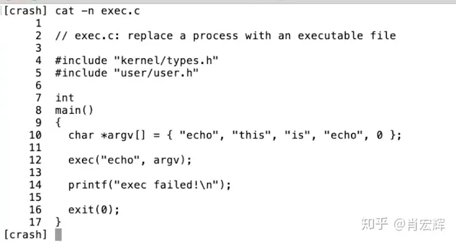

# 基本的系统调用

## open

第一个例子是，如果应用程序需要打开一个文件，它会调用名为open的系统调用，并且把文件名作为参数传给open。假设现在要打开一个名为“out”的文件，那么会将文件名“out”作为参数传入。同时我们还希望写入数据，那么还会有一个额外的参数，在这里这个参数的值是1，表明我想要写文件。

这里看起来像是个函数调用，但是open是一个系统调用，它会跳到Kernel，Kernel可以获取到open的参数，执行一些实现了open的Kernel代码，或许会与磁盘有一些交互，最后返回一个文件描述符对象。上图中的fd全称就是file descriptor。之后，应用程序可以使用这个文件描述符作为handle，来表示相应打开的文件。

## write

如果你想要向文件写入数据，相应的系统调用是write。你需要向write传递一个由open返回的文件描述符作为参数。你还需要向write传递一个指向要写入数据的指针（数据通常是char型序列），在C语言中，可以简单传递一个双引号表示的字符串（下图中的\n表示是换行）。第三个参数是你想要写入字符的数量。

第二个参数的指针，实际上是内存中的地址。所以这里实际上告诉内核，将内存中这个地址起始的6个字节数据写入到fd对应的文件中。

## read

它接收3个参数：

- 第一个参数是文件描述符，指向一个之前打开的文件。Shell会确保默认情况下，当一个程序启动时，文件描述符0连接到console的输入，文件描述符1连接到了console的输出。所以我可以通过这个程序看到console打印我的输入。当然，这里的程序会预期文件描述符已经被Shell打开并设置好。这里的0，1文件描述符是非常普遍的Unix风格，许多的Unix系统都会从文件描述符0读取数据，然后向文件描述符1写入数据。
- read的第二个参数是指向某段内存的指针，程序可以通过指针对应的地址读取内存中的数据，这里的指针就是代码中的buf参数。在代码第10行，程序在栈里面申请了64字节的内存，并将指针保存在buf中，这样read可以将数据保存在这64字节中。
- read的第三个参数是代码想读取的最大长度，sizeof(buf)表示，最多读取64字节的数据，所以这里的read最多只能从连接到文件描述符0的设备，也就是console中，读取64字节的数据。

read的返回值可能是读到的字节数，在上面的截图中也就是6（xyzzy加上结束符）。read可能从一个文件读数据，如果到达了文件的结尾没有更多的内容了，read会返回0。如果出现了一些错误，比如文件描述符不存在，read或许会返回-1。在后面的很多例子中，比如第16行，我都没有通过检查系统调用的返回来判断系统调用是否出错，但是你应该比我更加小心，你应该清楚系统调用通常是通过返回-1来表示错误，你应该检查所有系统调用的返回值以确保没有错误。

## fork

另一个你可能会用到的，更有意思的系统调用是fork。fork是一个这样的系统调用，它创建了一个与调用进程一模一样的新的进程，并返回新进程的process ID/pid。这里实际上会复杂的多，我们后面会有更多的介绍。

fork会拷贝当前进程的内存，并创建一个新的进程，这里的内存包含了进程的指令和数据。之后，我们就有了两个拥有完全一样内存的进程。fork系统调用在两个进程中都会返回，在原始的进程中，fork系统调用会返回大于0的整数，这个是新创建进程的ID。而在新创建的进程中，fork系统调用会返回0。所以即使两个进程的内存是完全一样的，我们还是可以通过fork的返回值区分旧进程和新进程。

所以对吧？这些系统调用看起来就跟普通的函数调用一样。系统调用不同的地方是，它最终会跳到系统内核中。

## exec

这个系统调用会从指定的文件中读取并加载指令，并替代当前调用进程的指令。从某种程度上来说，这样相当于丢弃了调用进程的内存，并开始执行新加载的指令。所以第12行的系统调用exec会有这样的效果：操作系统从名为echo的文件中加载指令到当前的进程中，并替换了当前进程的内存，之后开始执行这些新加载的指令。同时，你可以传入命令行参数，exec允许你传入一个命令行参数的数组，这里就是一个C语言中的指针数组，在上面代码的第10行设置好了一个字符指针的数组，这里的字符指针本质就是一个字符串（string)。

所以这里等价于运行echo命令，并带上“this is echo” 这三个参数。所以当我运行exec文件，

我可以看到“this is echo”的输出。即使我运行了exec程序，exec程序实际上会调用exec系统调用，并用echo指令来代替自己，所以这里是echo命令在产生输出。

有关exec系统调用，有一些重要的事情，

1. exec系统调用会保留当前的文件描述符表单。所以任何在exec系统调用之前的文件描述符，例如0，1，2等。它们在新的程序中表示相同的东西。
2. 通常来说exec系统调用不会返回，因为exec会完全替换当前进程的内存，相当于当前进程不复存在了，所以exec系统调用已经没有地方能返回了。

所以，exec系统调用从文件中读取指令，执行这些指令，然后就没有然后了。exec系统调用只会当出错时才会返回，因为某些错误会阻止操作系统为你运行文件中的指令，例如程序文件根本不存在，因为exec系统调用不能找到文件，exec会返回-1来表示：出错了，我找不到文件。所以通常来说exec系统调用不会返回，它只会在kernel不能运行相应的文件时返回。

> 学生提问：argv中的最后一个0是什么意思？
> Robert教授：它标记了数组的结尾。C是一个非常低阶（接近机器语言）的编程语言，并没有一个方法来确定一个数组究竟有多长。所以为了告诉内核数组的结尾在哪，我们将0作为最后一个指针。argv中的每一个字符串实际上是一块包含了数据的内存指针，但是第5个元素是0，通常来说指针0是一个NULL指针，它只表明结束。所以内核中的代码会遍历这里的数组，直到它找到了值为0的指针。

实际上，当我们在Shell中运行类似于“echo a b c”的指令，或者ls，或者任何命令，我们不会想要代替Shell进程，所以我们不会希望Shell执行exec系统调用。如果我们这么做了，这里会用echo指令来替代Shell进程，当echo退出了，一切就结束了。所以我们不想要echo替代Shell。实际上，Shell会执行fork，之后fork出的子进程再调用exec系统调用，这是一个非常常见的Unix程序调用风格。对于那些想要运行程序，但是还希望能拿回控制权的场景，可以先执行fork系统调用，然后在子进程中调用exec。

这里有一个简单的例子，来演示fork/exec程序。

在这个程序中的第12行，调用了fork。子进程从第14行开始，我们在子进程中与前一个程序一样调用exec。子进程会用echo命令来代替自己，echo执行完成之后就退出。之后父进程重新获得了控制。fork会在父进程中返回大于0的值，父进程会继续在第19行执行。

## wait

Unix提供了一个wait系统调用，如第20行所示。wait会等待之前创建的子进程退出。当我在命令行执行一个指令时，我们一般会希望Shell等待指令执行完成。所以wait系统调用，使得父进程可以等待任何一个子进程返回。这里wait的参数status，是一种让退出的子进程以一个整数（32bit的数据）的格式与等待的父进程通信方式。所以在第17行，exit的参数是1，操作系统会将1从退出的子进程传递到第20行，也就是等待的父进程处。&status，是将status对应的地址传递给内核，内核会向这个地址写入子进程向exit传入的参数。

Unix中的风格是，如果一个程序成功的退出了，那么exit的参数会是0，如果出现了错误，那么就会像第17行一样，会向exit传递1。所以，如果你关心子进程的状态的话，父进程可以读取wait的参数，并决定子进程是否成功的完成了。

先调用fork，再在子进程中调用exec。这里实际上有些浪费，fork首先拷贝了整个父进程的，但是之后exec整个将这个拷贝丢弃了，并用你要运行的文件替换了内存的内容。某种程度上来说这里的拷贝操作浪费了，因为所有拷贝的内存都被丢弃并被exec替换。在大型程序中这里的影响会比较明显。如果你运行了一个几G的程序，并且调用fork，那么实际就会拷贝所有的内存，可能会要消耗将近1秒钟来完成拷贝，这可能会是个问题。

在这门课程的后面，你们会实现一些优化，比如说copy-on-write fork，这种方式会消除fork的几乎所有的明显的低效，而只拷贝执行exec所需要的内存，这里需要很多涉及到虚拟内存系统的技巧。你可以构建一个fork，对于内存实行lazy拷贝，通常来说fork之后立刻是exec，这样你就不用实际的拷贝，因为子进程实际上并没有使用大部分的内存。

> - 学生提问：子进程可以等待父进程吗？
> - Robert教授：Unix并没有一个直接的方法让子进程等待父进程。wait系统调用只能等待当前进程的子进程。所以wait的工作原理是，如果当前进程有任何子进程，并且其中一个已经退出了，那么wait会返回。但是如果当前进程没有任何子进程，比如在这个简单的例子中，如果子进程调用了wait，因为子进程自己没有子进程了，所以wait会立即返回-1，表明出现错误了，当前的进程并没有任何子进程。
>   简单来说，不可能让子进程等待父进程退出。
> - 学生提问：当我们说子进程从父进程拷贝了所有的内存，这里具体指的是什么呢？是不是说子进程需要重新定义变量之类的？
> - Robert教授：在编译之后，你的C程序就是一些在内存中的指令，这些指令存在于内存中。所以这些指令可以被拷贝，因为它们就是内存中的字节，它们可以被拷贝到别处。通过一些有关虚拟内存的技巧，可以使得子进程的内存与父进程的内存一样，这里实际就是将父进程的内存镜像拷贝给子进程，并在子进程中执行。
>   实际上，当我们在看C程序时，你应该认为它们就是一些机器指令，这些机器指令就是内存中的数据，所以可以被拷贝。
> - 学生提问：如果父进程有多个子进程，wait是不是会在第一个子进程完成时就退出？这样的话，还有一些与父进程交错运行的子进程，是不是需要有多个wait来确保所有的子进程都完成？
> - Robert教授：是的，如果一个进程调用fork两次，如果它想要等两个子进程都退出，它需要调用wait两次。每个wait会在一个子进程退出时立即返回。当wait返回时，你实际上没有必要知道哪个子进程退出了，但是wait返回了子进程的进程号，所以在wait返回之后，你就可以知道是哪个子进程退出了。