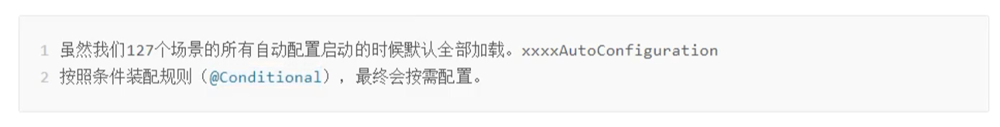
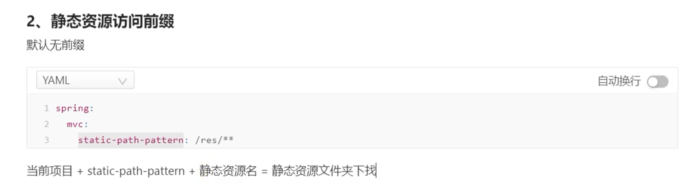

# 基础篇

## 对比


##  初体验


@RestController相当于@Controller+@ResponBody

## 解读

###  POM


### 引导类


### 内嵌tomcat


starter-web里面调用了starter-tomcat然后调用了starter-embed-core


如果不想用tomcat可以采用exclusion去除 再另行添加别的服务器


三种服务器


## restful


### 案例


### 简化注解


## 属性配置

### 修改服务器端口


即只需在该配置文件中书写需要修改的属性即可

**举例：**


### YAML


#### 语法


#### 读取YAML数据


#### 一次读取yaml全部数据


##### 封装数据


## 整合第三方技术

### 整合Junit


**==注意：==**


    


### 整合mybatis


### 整合mybatisPlus


### 整合Druid


## ssmp整合

### dao


### service


### controller


返回格式：


### 数据格式统一


### 前后端联调


# 运维篇

## 打包


### 比较


关键是下面的文件


## 配置


### 端口被占用


### 临时属性修改


### idea临时属性


#### 通过程序实现


#### 通过代码实现


### 配置文件权限


### 自定义配置文件


	

## 多环境开发


### YAML版


解决办法


### properties


### 功能拆分


### 开发控制


## 日志


### 基础


### 输出格式


### 日志文件


# 开发篇

## 热部署


### 自动热部署

算了 感觉没啥用 手动挺好

### 范围


## 配置高级


### 宽松绑定


### 单位


### 格式校验


## 测试

### 测试专用属性


### 测试专用配置


### web测试


#### 请求匹配


### 测试事务回滚


### 测试数据自动生成


# 数据层

## SQL


### 数据源

 

### 持久化方案


### 数据库


## NOSQL

### Redis


####   简介


#### 整合步骤


#### 测试


#### 客户端选择


#### 补充


也可以redisTemplate指定泛型为String


### MongoDB


#### 整合


### ES


#### 索引


其中books即为索引名字

**创建索引规则：**

------

在正常put索引时在body添加mapping条件


#### 文档


#### 整合

##### 低版本


##### 高版本


# 整合第三方

## 缓存


### springboot缓存


### 缓存商变更


# Thymeleaf

代替jsp，不用tomcat服务器就可以访问，将HTML赋予动态效果	


​	

# @EnableAutoConfiguration




# 自定义配置类yml文件代码提示

自定义的类和配置文件绑定一般没有提示。添加后使得有提示

```xml
    <dependency>
           <groupId>org.springframework.boot</groupId>
           <artifactId>spring-boot-configuration-processor</artifactId>
           <optional>true</optional>
       </dependency>
 
 
<build>
       <plugins>
           <plugin>
               <groupId>org.springframework.boot</groupId>
               <artifactId>spring-boot-maven-plugin</artifactId>
               <configuration>
                   <excludes>
                       <exclude>
                           <groupId>org.springframework.boot</groupId>
                           <artifactId>spring-boot-configuration-processor</artifactId>
                       </exclude>
                   </excludes>
               </configuration>
           </plugin>
       </plugins>
   </build>
```

# 静态资源访问

 

```yml
  spring:
    web:
     resources:
      static-locations: 
```

 改变静态资源的位置默认为

```java
  {
"classpath:/METAINF/resources/",
"classpath:/resources/","classpath:/static/", "classpath:/public/" 
  }
```



## 欢迎页


## 静态资源配置原理


# 表单提rest风格请求

原生表单只能提交get和post请求，put和delete请求会被转为post

springboot提供了一个拦截器来实现多请求兼容


```java
@Bean
@Conditional0nMissingBean(HiddenHttpMethodFilter.class)
ConditionalOnProperty(prefix = "spring.mvc.hiddenmethod.filter ", name = "enabled", matchIfMissing = false)
    public OrderedHiddenHttpMethodFilter hiddenHttpMethodFilter() {
return new OrderedHiddenHttpMethodFilter();
```


#  异常处理


