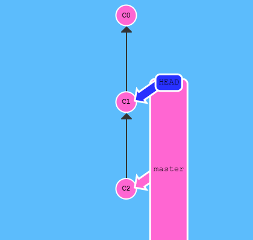

# g基础操作


# 分支


## 指定本地分支追踪远程分支

git branch -u origin/dev master

即指定本地master分支追踪远程dev分支 如果当前分支就是master 则最后的master可以省略

git checkout -b newBranch origin/branch

即指定一个新的分支追踪远程分支 即是当前并没有该分支

==即指定当前分支追踪某个分支时使用git branch -u 远程仓库名/远程分支名==

==如果想新建一个分支并追踪某个分支则使用 git checkout -b 本地新分支名 远程仓库名/远程分支名==

## push的参数

git push <remote>  <source>:<destination>

将source分支推送到指定远程仓库 destination分支

当目标分支不存在时远程仓库会创建该分支

==推送的同时也就默认将源分支追踪了目的分支，也达到了2.1的效果==

## reset和revert

reset用于本地分支 对远程分支无效 直接将head指向之前


revert用于远程分支 将做一次新的修改来弥补之前的修改


新提交记录 `C2'` 引入了**更改** —— 这些更改刚好是用来撤销 `C2` 这个提交的。也就是说 `C2'` 的状态与 `C1` 是相同的。

## merge和rebase

### merge

在 Git 中合并两个分支时会产生一个特殊的提交记录，它有两个父节点。翻译成自然语言相当于：“我要把这两个父节点本身及它们所有的祖先都包含进来。”


首先，`master` 现在指向了一个拥有两个父节点的提交记录。假如从 `master` 开始沿着箭头向上看，在到达起点的路上会经过所有的提交记录。这意味着 `master` 包含了对代码库的所有修改。


再把 `master` 分支合并到 `bugFix`

因为 `master` 继承自 `bugFix`，Git 什么都不用做，只是简单地把 `bugFix` 移动到 `master` 所指向的那个提交记录。

### rebase

Rebase 实际上就是取出一系列的提交记录，“复制”它们，然后在另外一个地方逐个的放下去。


注意当前所在的分支是 bugFix（星号标识的是当前分支）

我们想要把 bugFix 分支里的工作直接移到 master 分支上。移动以后会使得两个分支的功能看起来像是按顺序开发，但实际上它们是并行开发的。

注意，提交记录 C3 依然存在（树上那个半透明的节点），而 C3' 是我们 Rebase 到 master 分支上的 C3 的副本。

切换到了 `master` 上。把它 rebase 到 `bugFix` 分支上……

==git rebase bugFix==

由于 `bugFix` 继承自 `master`，所以 Git 只是简单的把 `master` 分支的引用向前移动了一下


==merge是将目标分支合并到当前分支，并产生一个新的记录，原来的记录不变；rebase是将当前分支与目标分支合并，当前分支原来节点废弃，产生新的节点包含了所有的记录==

==merge可以理解为我合并了目标分支，主线还是我，rebase则是变基到目标分支，主线是目标分支的主线==

## 相对引用

通过哈希值指定提交记录很不方便，所以 Git 引入了相对引用。这个就很厉害了!

使用相对引用的话，你就可以从一个易于记忆的地方（比如 `bugFix` 分支或 `HEAD`）开始计算。

相对引用非常给力，这里我介绍两个简单的用法：

- 使用 `^` 向上移动 1 个提交记录
- 使用 `~<num>` 向上移动多个提交记录，如 `~3`

首先看看操作符 (^)。把这个符号加在引用名称的后面，表示让 Git 寻找指定提交记录的父提交。

所以 `master^` 相当于“`master` 的父节点”。

`master^^` 是 `master` 的第二个父节点

现在咱们切换到 master 的父节点

git checkout master^



如果你想在提交树中向上移动很多步的话，敲那么多 `^` 貌似也挺烦人的，Git 当然也考虑到了这一点，于是又引入了操作符 `~`。

该操作符后面可以跟一个数字（可选，不跟数字时与 `^` 相同，向上移动一次），指定向上移动多少次。


==使用相对引用最多的就是移动分支。可以直接使用 `-f` 选项让分支指向另一个提交。例如:==

```git
git branch -f master HEAD~3
```

==上面的命令会将 master 分支强制指向 HEAD 的第 3 级父提交。==

## HEAD==大写==

HEAD 是一个对当前检出记录的符号==引用（同样的，分支名也是引用）== —— 也就是指向你正在其基础上进行工作的提交记录。

HEAD 总是指向当前分支上最近一次提交记录。大多数修改提交树的 Git 命令都是从改变 HEAD 的指向开始的。

HEAD 通常情况下是指向分支名的（如 bugFix）。在你提交时，改变了 bugFix 的状态，这一变化通过 HEAD 变得可见。

HEAD 指向了 `master`，随着提交向前移动。

如果想看 HEAD 指向，可以通过 `cat .git/HEAD` 查看， 如果 HEAD 指向的是一个引用，还可以用 `git symbolic-ref HEAD` 查看它的指向。


==也就是说 checkout改变的是head的指向位置，而不是分支所指向的位置，我们想要移动分支是通过branch -f 分支名 移动位置 来操作==
