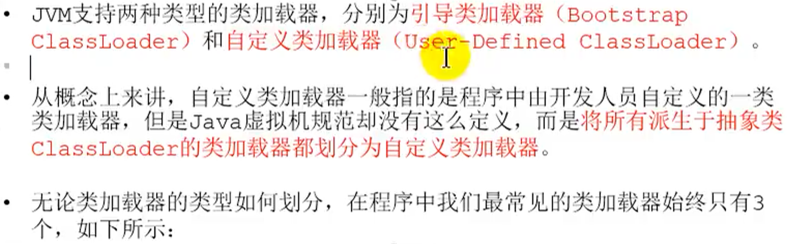
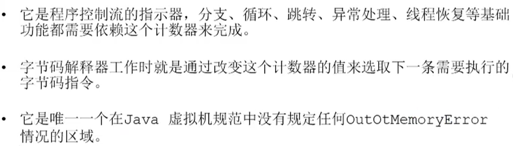
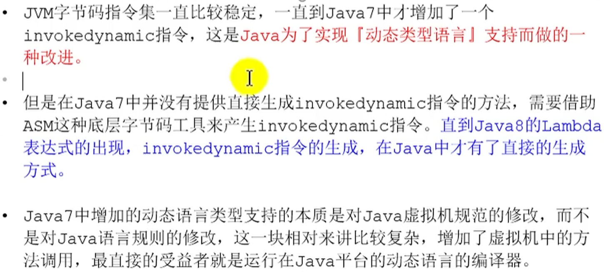
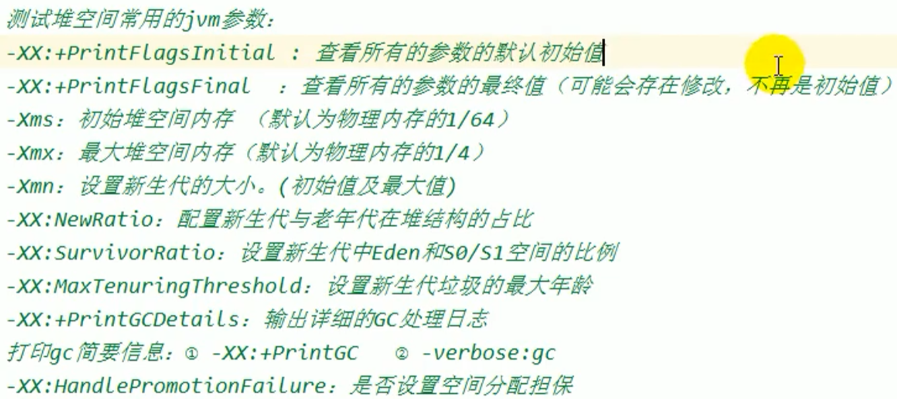
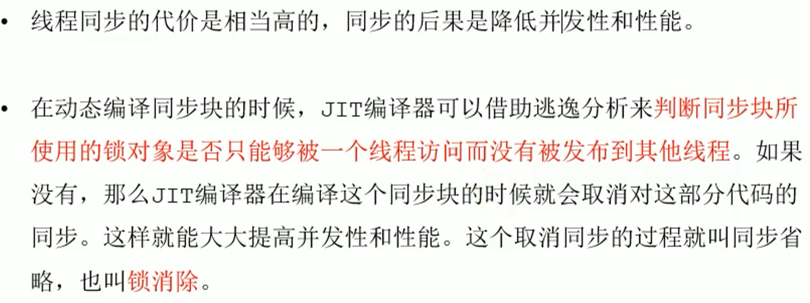
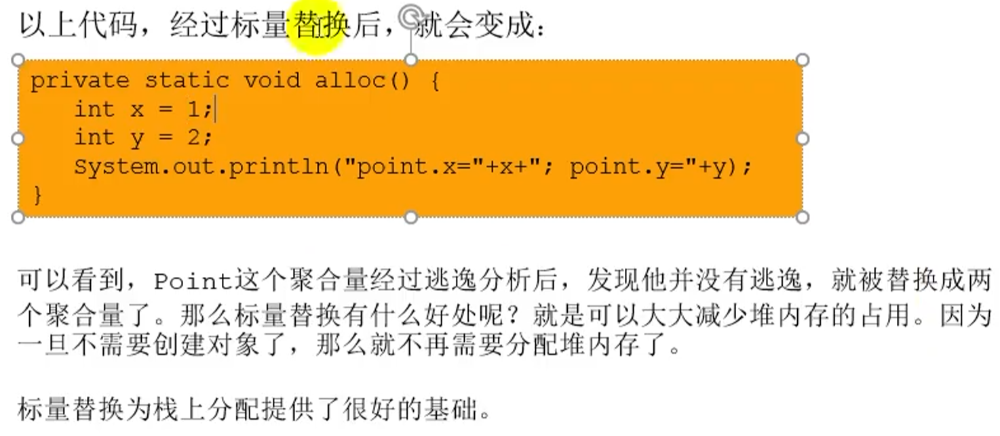
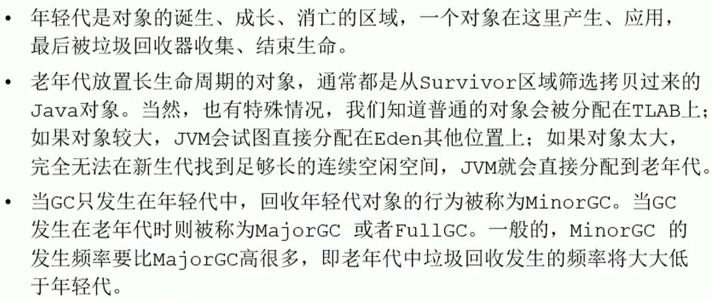
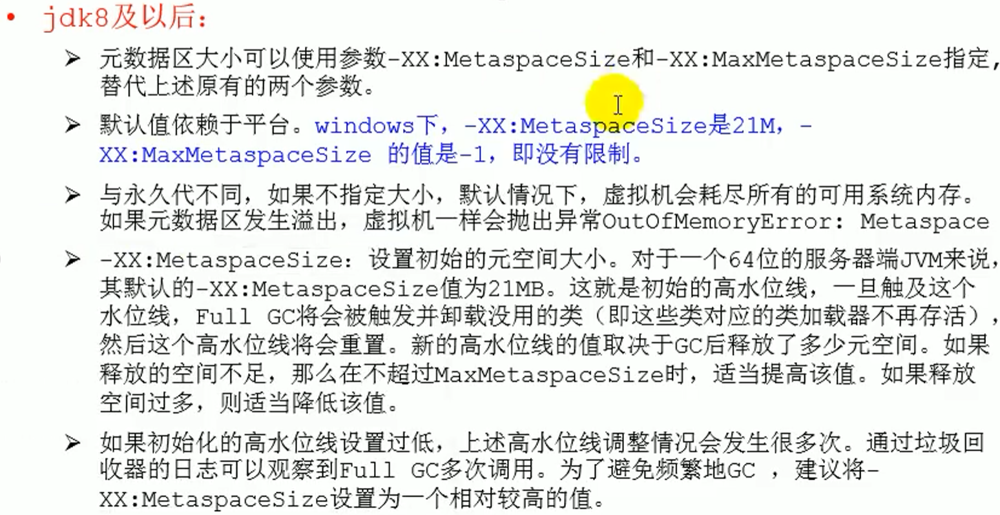
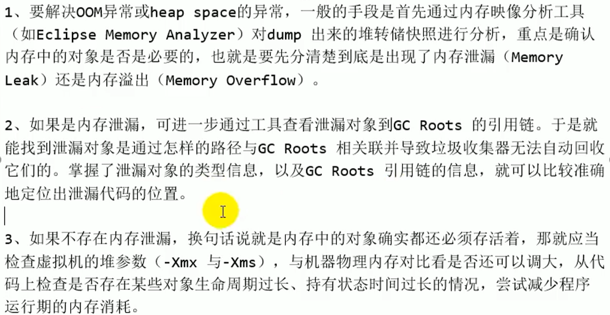
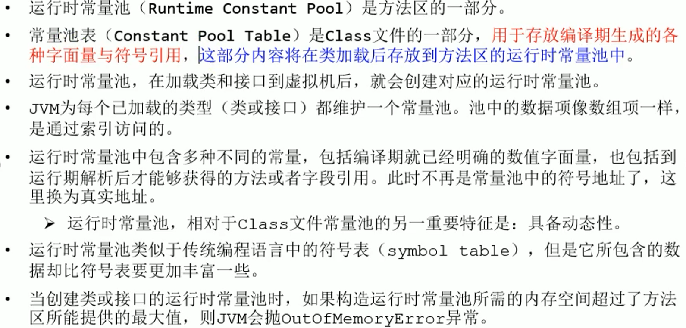

# jvm整体结构

# jvm生命周期

#  jvm发展

# 类加载子系统

##  加载

## 链接

## 初始化

## 类加载器分类

### 引导类加载器

### 扩展类加载器

### 系统类加载器

### 用户自定义类加载器

## 双亲委派机制

## 沙箱安全机制

## 补充

# 运行时数据区

## 线程

## pc register

## 虚拟机栈

### 栈存储单位

### 栈运行原理

### 栈帧内部结构

#### 局部变量表

#### slot

#### 操作数栈

#### 栈顶缓存技术

 

#### 动态链接

#### 方法调用

#### 方法重写

#### 方法返回地址

## 本地方法接口

### 为何使用

## 本地方法栈

## 堆

### 设置

### 对象分配过程

### GC简介

### 分代思想

### 总结

### TLAB

### 参数小结

### 逃逸分析

#### 栈上分配

#### 同步省略

#### 分离对象及标量替换    

#### 小结

### 堆总结

## 方法区/元空间

### 交互

 	

​																																																																																																																																																																																																																																																																																																																												

### HOTSPOT 发展

### 设置方法区大小与OOM

### 内部结构

####  常量池

#### 运行时常量池

### 发展

### 原因

### 垃圾收集

## 总结

