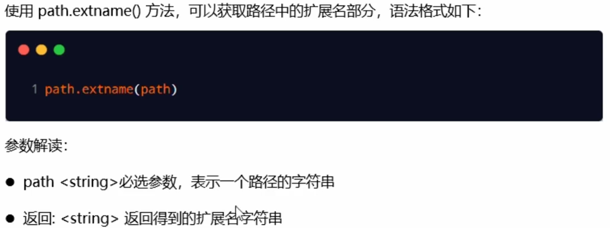
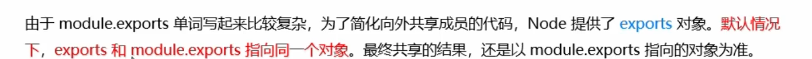
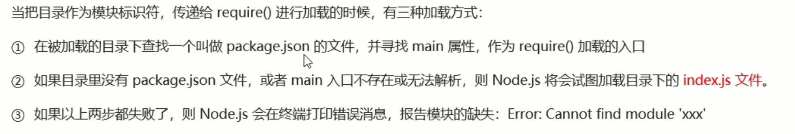
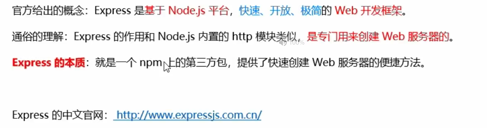

# 简介

# fs模块

## readFile

## writeFile

## 动态拼接问题

# path路径模块

## join

## basename

## extname

# http模块

## req

## res

# 模块化

## module

## module.exports

## exports

## 模块化规范

# npm

## package.json

## devDependencies

## 镜像

# nrm

# 包的分类

# i5ting_toc

# 模块加载

# express

 

## 托管静态资源

## 挂载路径前缀

# nodemon

# 路由

## 使用

## 模块化路由

# 中间件

## 格式

## next

## 定义中间件

## 全局中间件

## 作用

## 局部中间件

## 注意事项

## 分类

# 跨域问题

# web开发模式

## 服务端渲染

## 前后端分离

# 身份认证

